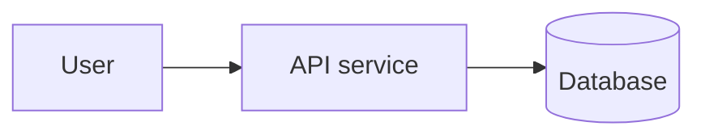
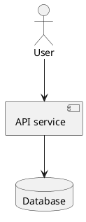

# Skill: Architecture Diagrams

Create diagrams that are accurate, readable, and useful for architecture decisions. Prefer the
smallest diagram that answers the question.

## Workflow

1. **Define the diagram job.** Identify audience, decision, abstraction level, scope boundary, and
   target artifact (`docs/ARCHITECTURE.md`, `docs/blueprints/`, `docs/spec/`, ADR, or chat).
2. **Gather source facts.** Read the relevant architecture docs, blueprints, specs, ADRs, and code.
   Do not invent nodes, protocols, ownership, or direction. Mark unknowns as assumptions.
3. **Choose notation deliberately.** Match the diagram type to the question; avoid mixing
   abstraction levels in one diagram.
4. **Draft with stable labels.** Use durable node IDs, human-readable labels, explicit boundaries,
   and edge labels for protocols, events, data, or ownership when those details matter.
5. **Validate.** Render or syntax-check when a local Mermaid/PlantUML/Graphviz tool is available.
   If not rendered, say that validation was textual only.
6. **Keep it maintainable.** If a diagram exceeds roughly 20-25 nodes or multiple concerns, split
   it into separate context, container/component, interaction, or deployment diagrams.

## Notation Selection

| Use case | Prefer | Notes |
| --- | --- | --- |
| System context and ownership boundaries | C4 context or Mermaid flowchart | Show people, external systems, and the system under design. |
| Deployable/runtime units | C4 container or UML deployment | Distinguish processes, services, databases, queues, and infrastructure nodes. |
| Internal module structure | C4 component, UML component, or Mermaid flowchart | Keep dependencies directional and layer-aligned. |
| Request/event interactions | UML sequence or Mermaid `sequenceDiagram` | Use lifelines for participants and label sync/async behavior. |
| Lifecycle or state semantics | UML state machine or Mermaid `stateDiagram-v2` | Show states, events, guards, and terminal states. |
| Business workflow | BPMN-style activity flow or Mermaid flowchart | Use swimlanes only when ownership matters. |
| Data model | ERD or Mermaid `erDiagram` | Show entities, cardinality, and ownership; do not use ERD for service dependencies. |
| Enterprise capability layers | ArchiMate | Use only when the repo already uses enterprise architecture notation or the user asks. |
| Dependency graph with layout pressure | Graphviz DOT | Use when Mermaid layout is too ambiguous for dense graphs. |
| Security/trust boundaries | DFD-style flowchart | Show actors, processes, stores, data flows, and trust boundaries. |

## Standards Guardrails

- **UML:** use the diagram type semantically. Classes model types; components model replaceable
  implementation units; deployment diagrams model nodes/artifacts; sequence diagrams model ordered
  messages between lifelines; activity diagrams model workflow; state machines model valid state
  transitions.
- **C4:** keep levels separate: Context -> Container -> Component -> Code. Use boundaries for
  systems, containers, or teams, and avoid component detail in a context diagram.
- **Mermaid:** emit fenced `mermaid` blocks for Markdown. Prefer `flowchart LR` or `flowchart TB`
  for structure, quote labels containing punctuation, keep IDs ASCII and stable, and avoid
  renderer-specific beta syntax unless the target renderer supports it.
- **PlantUML:** prefer when UML fidelity matters more than Markdown-native rendering, especially
  for precise component, deployment, class, or sequence notation.
- **Graphviz:** prefer for large dependency graphs where rank, clustering, or layout control matters.
- **ArchiMate/BPMN:** use only when their formal semantics are needed; otherwise a simpler C4, UML,
  or Mermaid diagram is easier to maintain.

When exact standard or syntax details matter, consult primary documentation first: OMG UML,
Mermaid, PlantUML, Graphviz DOT, the C4 model, ArchiMate, or BPMN documentation. Prefer current
official docs over memory for renderer-specific syntax.

## Diagram Quality Checklist

- The diagram answers one concrete question.
- Every node and edge is backed by repo evidence or explicitly marked as an assumption.
- External systems and trust or ownership boundaries are visible.
- Edge direction is meaningful and labeled when the relation is not obvious.
- The diagram does not cross abstraction levels without a clear reason.
- The output includes a short caption and the source files or docs used.
- Specs and approval briefs summarize diagrams rather than dumping large diagrams into chat.

## Output Patterns

For Markdown-native docs, prefer:

For precise UML in Markdown, prefer PlantUML when supported:

