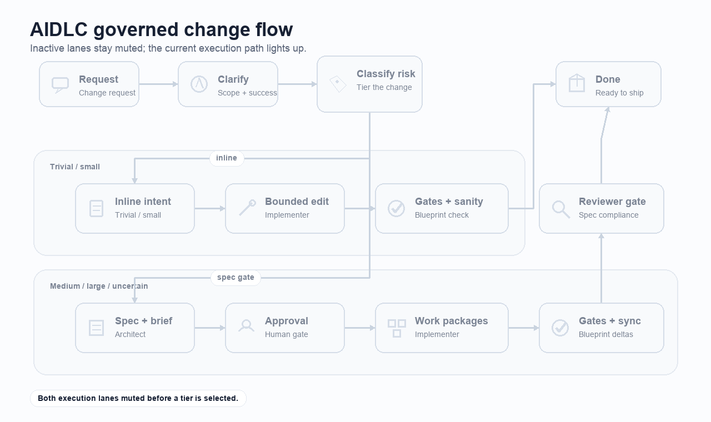
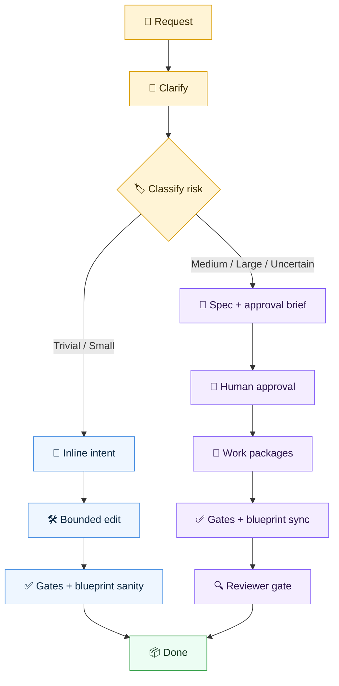

# AIDLC

AIDLC is a portable governance harness for AI-assisted software projects. It gives coding agents a
shared operating model: how to classify change risk, when to write a spec, which agent persona owns
planning or implementation, and where project facts such as architecture, contracts, and test gates
must live.

The `aidlc` CLI installs and updates that harness in a repository, then projects it into IDE-native
files for Codex, Claude, Cursor, Copilot, and Windsurf.

## Table of Contents

- [Install](#install)
- [Setup](#setup)
- [What the Harness Provides](#what-the-harness-provides)
- [Governed Change Flow](#governed-change-flow)
- [Responsibility Matrix](#responsibility-matrix)
- [Agents](#agents)
- [Skills](#skills)
- [CLI Commands](#cli-commands)
- [Maintainer Notes](#maintainer-notes)
- [License](#license)

## Install

Choose one installation path.

### Curl

The Unix installer downloads the latest GitHub release, verifies the checksum, and installs
`aidlc` to `/usr/local/bin`.

```sh
curl -fsSL https://raw.githubusercontent.com/shubhangtiwari/aidlc/main/aidlc/scripts/install.sh | sudo sh
```

### Homebrew

Homebrew can install directly from the tap:

```sh
brew install shubhangtiwari/aidlc/aidlc
```

Verify the install:

```sh
aidlc version
```

## Setup

Run setup from the root of the repository you want AIDLC to govern.

### 1. Create the IDE files

`aidlc init <ide>` installs the portable harness payload and generates the IDE-specific files your
assistant will read.

```sh
aidlc init codex
aidlc init claude
aidlc init cursor
aidlc init copilot
aidlc init windsurf
aidlc init all
```

Typical generated files include `AGENTS.md`, `CLAUDE.md`, `.codex/**`, `.claude/**`,
`.cursor/**`, `.github/copilot-instructions.md`, and `.windsurfrules`, depending on the IDE target.

### 2. Initialise the harness

After the IDE files exist, ask your agent to initialise the harness. Good prompts are:

```text
initialise harness
initialise architecture
set up AIDLC for this repo
```

The initialization pass reads the repository, identifies the language/runtime shape, suggests the
best-fit architecture profile, and writes the project-specific governance docs. It creates or
refreshes `docs/ARCHITECTURE.md`, adds the matching `docs/architecture/<domain>.md` layer rules, and
finds logical modules that should have blueprints under `docs/blueprints/`. It also leaves ADRs
under `docs/adr/` as the place for cross-cutting architecture decisions that should be explicit
before implementation.

### 3. Keep the harness current

When AIDLC changes upstream, update the installed harness payload and regenerate the IDE projection:

```sh
aidlc update
```

Upgrade the installed CLI itself when a newer release is available. For the curl installer path,
use the native upgrader:

```sh
aidlc upgrade
```

For a Homebrew-managed install, keep the binary under Homebrew control:

```sh
brew upgrade shubhangtiwari/aidlc/aidlc
```

## What the Harness Provides

AIDLC separates portable agent behavior from project-specific truth.

- `.ai/` contains portable personas, skills, templates, and generation rules.
- `docs/ARCHITECTURE.md` and `docs/architecture/` describe the actual project structure and layer
  rules after initialization.
- `docs/adr/` records architecture decisions that affect multiple modules, integrations, or long-term
  project direction.
- `docs/blueprints/` records module-level contracts, owned state, integration boundaries, and test
  gates.
- `docs/spec/` holds approved plans for medium and large changes.
- Generated IDE files such as `AGENTS.md`, `CLAUDE.md`, `.codex/**`, and `.cursor/**` are projections
  of the portable harness. Regenerate them with `aidlc init <ide>` or `aidlc update`; do not maintain
  them by hand.

The harness is intentionally not a framework. It does not guess your architecture, dependencies, or
quality gates. It creates a disciplined place to document them.

## Governed Change Flow

Every request starts with a quick risk classification. Low-risk work stays lightweight; risky work
goes through a spec and review gate.



Static version:



## Responsibility Matrix

| Area | Source of truth | Responsibility |
| --- | --- | --- |
| Portable agent behavior | `.ai/` | Personas, skills, templates, and generated guidance content. |
| Project architecture | `docs/ARCHITECTURE.md`, `docs/architecture/` | Layer rules, ownership boundaries, execution model, and command policy. |
| Architecture decisions | `docs/adr/` | Cross-cutting decisions, tradeoffs, and rationale that should outlive a single change. |
| Module contracts | `docs/blueprints/` | Public contracts, owned state, read-only paths, integrations, topology, and gates. |
| Planned changes | `docs/spec/` | Approved specs, work packages, and implementation constraints. |
| Commands and gates | `Makefile` | Supported local workflows for init, update, tests, release checks, and governance validation. |
| Generated IDE guidance | `AGENTS.md`, `CLAUDE.md`, `.codex/**`, `.cursor/**`, `.claude/**` | Tool-specific projection of the portable harness. |
| Sync state | `aidlc.lock.json` | Selected IDEs, tracked payload checksums, source metadata, and generation metadata. |

## Agents

AIDLC defines three delegable personas:

| Agent | Role |
| --- | --- |
| `architect` | Plans medium, large, or uncertain work. Writes specs and approval briefs; does not implement. |
| `implementer` | Applies approved plans within assigned files, layers, and work packages. Performs blueprint sanity checks. |
| `reviewer` | Validates medium and large implementation diffs against the spec, layer rules, and blueprints. |

The main agent coordinates the flow: classify, route, enforce the spec gate, and report the final
state.

## Skills

AIDLC ships focused playbooks that agents can invoke when the task calls for them:

| Skill | Purpose |
| --- | --- |
| `classify-change` | Mandatory triage for governed implementation requests. |
| `init-architecture` | Initializes or refreshes project architecture documentation from repository evidence. |
| `orchestrate-spec` | Executes approved specs by dependency-ordered work-package waves. |

Skills define procedure. Personas define authority.

## CLI Commands

```text
aidlc init <claude|codex|cursor|copilot|windsurf|all> [flags]
aidlc update [flags]
aidlc upgrade [flags]
aidlc version
```

For CLI options, flags, output format, and exit codes, see the native CLI reference:
[aidlc/README.md](aidlc/README.md).

## Maintainer Notes

Run repository gates through the Makefile:

```sh
make test
make aidlc-release-check
```

Release tags for the CLI use the `aidlc/vX.Y.Z` shape because the Go module lives under `aidlc/`.
After publishing a new CLI release, update the Homebrew tap formula to point at the new tag and
checksum so `brew upgrade shubhangtiwari/aidlc/aidlc` can install it.

## License

MIT License - Copyright (c) 2026
[Shubhang Tiwari](mailto:shubh.bitsmith@gmail.com).
