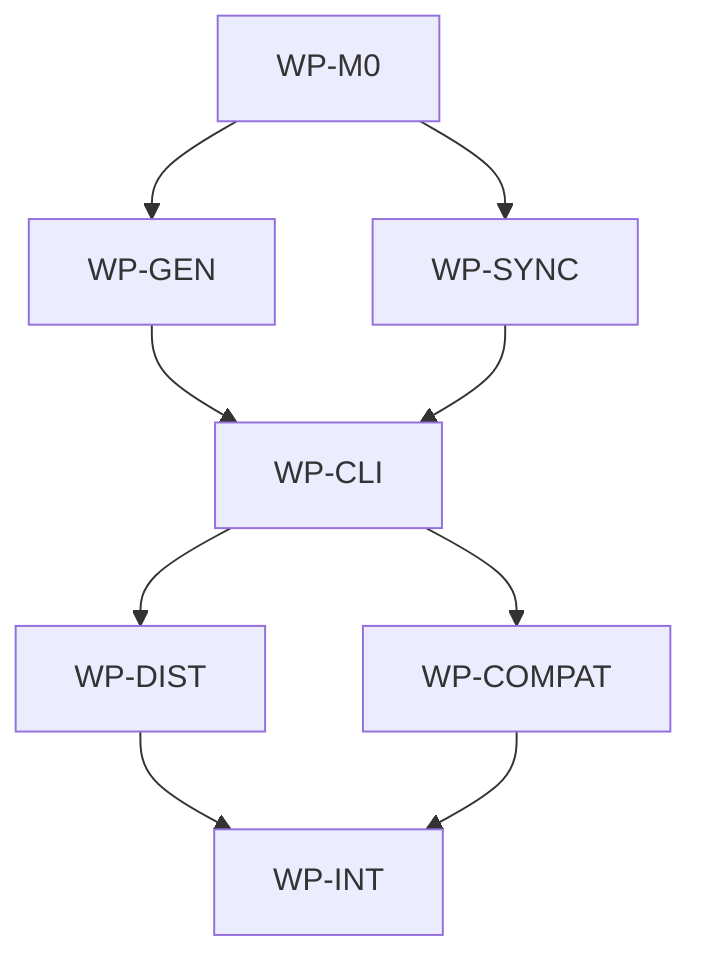

# Add installable AIDLC CLI

## Context

The repository currently distributes AIDLC governance through a root template, Bash scripts, and
Make targets. The requested change adds `aidlc` as an installable product surface in the same
repository so users can initialize and update AIDLC governance without cloning the template or
depending on Unix-only tooling.

## Goal

Ship an installable `aidlc` CLI that initializes and updates AIDLC governance payloads
non-destructively across supported platforms while keeping the root template payload and existing
`make init <ide>` compatibility intact.

## Non-goals

- Replacing AIDLC governance personas, skills, or the spec gate model.
- Making Windows users install Bash, Make, rsync, or git for normal `aidlc init` and `aidlc update`
  flows.
- Publishing project-specific in-flight specs, ADRs, blueprints, architecture docs, CLI
  implementation files, CI, or release files into consumer repositories as part of the template
  payload.
- Supporting arbitrary remote template repositories beyond the public GitHub source and explicit
  local-source test/development mode.

## Constraints

- Keep root-level language manifests out of the repository; the Go module lives under `aidlc/`.
- Prefer Go static binaries unless the ADR discovers a stronger reason to change.
- Preserve `make init <claude|codex|cursor|copilot|windsurf|all>` and `make update` compatibility.
- `aidlc init <ide>` must be additive: existing files are skipped when identical and reported as
  conflicts when divergent.
- `aidlc update` must use a persisted manifest with upstream commit/ref, path, checksum, and
  generation metadata; it must not delete or overwrite project docs blindly.
- Payload selection is controlled by a strict public template manifest/allowlist. The CLI must not
  infer payload membership from broad directories such as `docs/`.
- Public payload paths are limited to `.ai/**`, starter docs/templates intentionally listed in the
  public template manifest, and license files.
- The public template manifest must exclude `docs/spec/*.md` created for this repo, `docs/adr/*.md`
  except starter/template docs intentionally listed as public, `docs/blueprints/*.md` except
  README/template starters intentionally listed as public, `docs/ARCHITECTURE.md`,
  `docs/architecture/**`, `aidlc/**`, `.github/**`, release files, and other implementation-only
  files.
- The CLI must use native Go filesystem, archive, checksum, HTTP, and rendering logic; normal CLI
  flows must not shell out to Bash, Make, rsync, or git.
- Medium/large governed implementation requires this draft to be approved before production code is
  written, and reviewer must run after implementation.

## Affected files

- `docs/ARCHITECTURE.md`
- `docs/architecture/software.md`
- `docs/adr/1780346463-aidlc-cli-distribution-and-sync.md`
- `docs/blueprints/aidlc.md`
- `docs/blueprints/template-payload.md`
- `Makefile`
- `.ai/template-manifest.yaml`
- `.ai/scripts/ai_init.sh`
- `.ai/scripts/ai_update.sh`
- `.github/workflows/aidlc-ci.yml`
- `.github/workflows/aidlc-release.yml`
- `aidlc/go.mod`
- `aidlc/go.sum`
- `aidlc/README.md`
- `aidlc/.goreleaser.yaml`
- `aidlc/cmd/aidlc/main.go`
- `aidlc/internal/cli/root.go`
- `aidlc/internal/commands/init.go`
- `aidlc/internal/commands/update.go`
- `aidlc/internal/commands/version.go`
- `aidlc/internal/contract/ide.go`
- `aidlc/internal/contract/manifest.go`
- `aidlc/internal/contract/options.go`
- `aidlc/internal/payload/paths.go`
- `aidlc/internal/generator/generator.go`
- `aidlc/internal/generator/ide.go`
- `aidlc/internal/generator/models.go`
- `aidlc/internal/generator/project_facts.go`
- `aidlc/internal/generator/render.go`
- `aidlc/internal/generator/templates.go`
- `aidlc/internal/source/archive.go`
- `aidlc/internal/source/github.go`
- `aidlc/internal/source/local.go`
- `aidlc/internal/source/source.go`
- `aidlc/internal/sync/checksum.go`
- `aidlc/internal/sync/conflict.go`
- `aidlc/internal/sync/copy.go`
- `aidlc/internal/sync/manifest_store.go`
- `aidlc/internal/sync/planner.go`
- `aidlc/internal/install/checksums.go`
- `aidlc/internal/compat/make_test.go`
- `aidlc/internal/generator/generator_test.go`
- `aidlc/internal/generator/project_facts_test.go`
- `aidlc/internal/commands/init_test.go`
- `aidlc/internal/commands/update_test.go`
- `aidlc/internal/sync/planner_test.go`
- `aidlc/internal/sync/manifest_store_test.go`
- `aidlc/internal/install/checksums_test.go`
- `aidlc/internal/integration/init_update_test.go`
- `aidlc/internal/integration/windows_paths_test.go`
- `aidlc/internal/testutil/fs.go`
- `aidlc/scripts/install.sh`
- `aidlc/scripts/install.ps1`
- `aidlc/scripts/verify-release.sh`
- `aidlc/testdata/generator/minimal/.keep`
- `aidlc/testdata/payload/public-repo/.keep`
- `aidlc/testdata/compat/existing-template/.keep`
- `aidlc/testdata/integration/source-repo/.keep`
- `aidlc/testdata/integration/target-repo/.keep`

## Work packages

| ID | Title | Domain | Layer | Wave | Depends on | Parallel? |
| --- | --- | --- | --- | --- | --- | --- |
| WP-M0 | Architecture, ADR, shared contracts, and gates | software | contracts | 0 | - | alone |
| WP-GEN | Native IDE generator | software | application | 1 | WP-M0 | with WP-SYNC |
| WP-SYNC | Payload source and conflict-aware sync engine | software | application | 1 | WP-M0 | with WP-GEN |
| WP-CLI | aidlc command surface | software | interface | 2 | WP-GEN, WP-SYNC | alone |
| WP-DIST | Cross-platform install and release packaging | software | infrastructure | 3 | WP-CLI | with WP-COMPAT |
| WP-COMPAT | Existing Make and Bash compatibility | software | interface | 3 | WP-CLI | with WP-DIST |
| WP-INT | End-to-end integration and blueprint sync | software | integration | 4 | WP-DIST, WP-COMPAT | alone |

## Dependency tree

## Parallel execution plan

| Wave | Work packages | Max parallel implementers |
| --- | --- | --- |
| 0 | WP-M0 | 1 |
| 1 | WP-GEN, WP-SYNC | 2 |
| 2 | WP-CLI | 1 |
| 3 | WP-DIST, WP-COMPAT | 2 |
| 4 | WP-INT | 1 |

## Blueprint deltas

- **`docs/blueprints/aidlc.md` § Package Purpose**: Add the installable CLI module rooted at
  `aidlc/`, with Go as the implementation language and the software domain profile.
- **`docs/blueprints/aidlc.md` § Package Boundary**: Declare that `aidlc/` owns CLI command
  contracts, manifest schema, native IDE generation, payload sync, installers, and release checks.
- **`docs/blueprints/aidlc.md` § Layer Map**: Map `cmd/aidlc` to interface, `internal/commands` to
  application orchestration, `internal/generator` and `internal/sync` to application services,
  `internal/source` and `internal/install` to infrastructure, and `internal/contract` to shared
  contracts.
- **`docs/blueprints/aidlc.md` § Cross-package Contracts**: Publish the command contract,
  `.aidlc/manifest.json` schema, public template manifest schema, supported IDE list, payload path
  policy, and exit-code behavior.
- **`docs/blueprints/aidlc.md` § Owned State**: Document that target repositories may receive
  `.aidlc/manifest.json` and generated IDE files, while the source repo owns no durable runtime
  state beyond release artifacts.
- **`docs/blueprints/aidlc.md` § Integration Boundaries**: Document GitHub archive/release access,
  Homebrew formula generation, curl installers, and local-source mode for tests.
- **`docs/blueprints/aidlc.md` § Test Gates**: Add `make aidlc-test`, `make aidlc-release-check`,
  `make test`, and `make validate-governance`.
- **`docs/blueprints/template-payload.md` § Public Payload Contract**: Define the strict
  `.ai/template-manifest.yaml` allowlist for public template payload paths. The contract must state
  that broad `docs/` copying is forbidden and only listed `.ai/**`, starter docs/templates, and
  license files may be copied.
- **`docs/blueprints/template-payload.md` § Read-only Paths**: Explicitly mark repo-local
  implementation docs and code as non-payload: `docs/spec/*.md`, non-public `docs/adr/*.md`,
  non-public `docs/blueprints/*.md`, `docs/ARCHITECTURE.md`, `docs/architecture/**`, `aidlc/**`,
  `.github/**`, and release files.
- **`docs/blueprints/template-payload.md` § Update Semantics**: Document additive init,
  checksum-aware update, conflict reporting, skipped identical files, and non-deletion of unknown
  local project files.

## Test plan

- `aidlc/internal/generator/generator_test.go` - verifies native generation for each supported IDE
  and `all`.
- `aidlc/internal/generator/project_facts_test.go` - verifies manifest detection and generic
  no-manifest defaults.
- `aidlc/internal/sync/planner_test.go` - verifies create, skip, update-clean, local-conflict,
  upstream-removed, unknown-local-file decisions, and rejection of source files not listed in the
  public template manifest.
- `aidlc/internal/sync/manifest_store_test.go` - verifies `.aidlc/manifest.json` read/write,
  checksum persistence, upstream ref/commit recording, and backwards-compatible schema handling.
- `aidlc/internal/commands/init_test.go` - verifies `aidlc init <ide>` copies payload
  non-destructively, triggers generation, and does not copy repo-local specs, ADRs, blueprints,
  architecture docs, `aidlc/**`, `.github/**`, or release files.
- `aidlc/internal/commands/update_test.go` - verifies `aidlc update` applies clean upstream changes
  and refuses divergent overwrites while continuing to exclude repo-local implementation docs and
  release files even when they exist in the upstream source repo.
- `aidlc/internal/compat/make_test.go` - verifies `make init <ide>` compatibility remains aligned
  with `aidlc init <ide>`.
- `aidlc/internal/install/checksums_test.go` - verifies installer checksum parsing and validation.
- `aidlc/internal/integration/init_update_test.go` - verifies end-to-end init then update against a
  local fixture source repo containing both public template files and repo-local implementation
  files; initialized and updated target repos contain only allowlisted template payload paths.
- `aidlc/internal/integration/windows_paths_test.go` - verifies path normalization and generated
  files on Windows-style paths.
- `make aidlc-test` - runs Go tests for the isolated `aidlc/` module.
- `make aidlc-release-check` - validates release configuration and installer checksum paths.
- `make test` - runs the full repository gate, including CLI tests and governance validation.
- `make validate-governance` - validates spec, blueprint, ADR, and generated governance invariants.

## Open questions

None.

## Implementation notes

- 2026-06-02: Main-session triage classified this as large with `next: draft-spec` because it adds
  a new installable CLI product surface, source layout, command contract, cross-platform install
  behavior, update semantics, tests, release distribution, and ADR-worthy architecture decisions.
- 2026-06-02: Amended draft after user feedback to require a strict public template
  manifest/allowlist and explicit negative tests preventing AIDLC implementation docs, specs, ADRs,
  blueprints, architecture docs, CLI source, CI, and release files from leaking into consumer
  repositories.
- 2026-06-02: Reviewer follow-up wired `make aidlc-release-check` to the release verifier and
  narrowed generated `.github/` ignores so release workflows remain trackable. The release gate
  pins the verifier to a stable Go toolchain that passes native tests and cross-builds on the local
  macOS runner while keeping root-level Go manifests absent.
