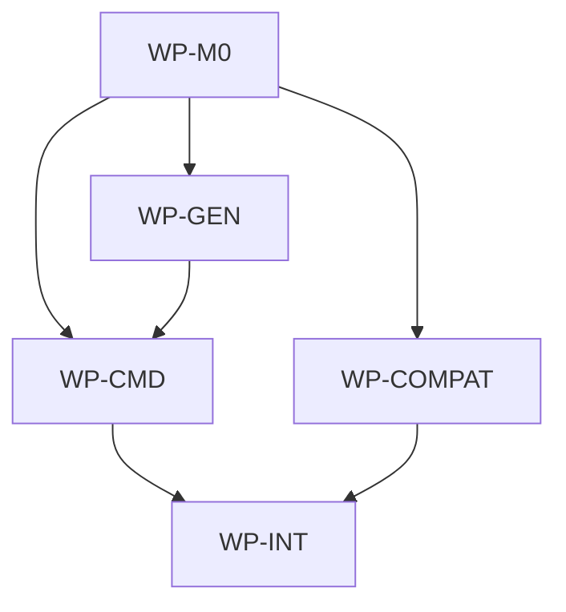

# Persist workspace IDE selections

## Context

`aidlc init <ide>` currently records a single `generated.ide` value in `.aidlc/manifest.json`, and
`aidlc update` updates payload files without regenerating generated IDE files. Users who initialize
more than one IDE surface, or who expect update to refresh the generated files after `.ai/` changes,
need the workspace's selected IDEs to be persisted and reused by update. The persisted target lock
must live at the repository root as `aidlc.lock.json`, not under `.aidlc/`.

## Goal

Persist the workspace's selected concrete IDEs in root `aidlc.lock.json` and make `aidlc update`
regenerate those IDE files after clean updates.

## Non-goals

- Removing or renaming the existing `generated.ide` manifest field.
- Deleting existing legacy `.aidlc/manifest.json` files from target repositories.
- Adding a new user-facing `aidlc update <ide>` command or CLI flag.
- Deleting generated IDE files for IDEs no longer selected.
- Changing supported IDE identifiers.
- Replacing the Bash compatibility `make init <ide>` surface with a Go-only dependency.

## Constraints

- The authoritative target lock path is root `aidlc.lock.json`.
- `aidlc.lock.json` contains `workspace.ides` plus the existing init/update lock metadata currently
  represented by the target manifest contract: schema version, upstream source/ref/commit,
  `generated.ide`, tracked payload paths, checksums, file modes, and command metadata such as source
  kind and local source path.
- The authoritative persisted IDE selection is `aidlc.lock.json` field `workspace.ides`.
- `workspace.ides` stores concrete IDE identifiers only: `claude`, `codex`, `cursor`, `copilot`,
  and `windsurf`; it must not store the aggregate `all` sentinel.
- Persisted IDEs are de-duplicated and written in the canonical supported IDE order.
- Root `aidlc.lock.json` takes precedence when both it and legacy `.aidlc/manifest.json` exist.
- `generated.ide` remains available for existing readers and legacy manifests, but command behavior
  must prefer `workspace.ides` when present in the selected lock source.
- When `aidlc.lock.json` is absent, commands read legacy `.aidlc/manifest.json` as fallback.
  Legacy manifests without `workspace.ides` fall back to `generated.ide`; `generated.ide: all`
  expands to every concrete IDE.
- Successful mutating `aidlc init`, `aidlc update`, and Bash `make init <ide>` runs write
  `aidlc.lock.json`; they do not need to continue writing `.aidlc/manifest.json`.
- Dry runs and conflict exits must not write generated IDE files, migrate legacy manifests, or mutate
  `aidlc.lock.json` / `.aidlc/manifest.json`.
- Normal `aidlc init` and `aidlc update` flows must not shell out to Bash, Make, rsync, or git.
- Bash compatibility updates in `.ai/scripts/ai_init.sh` may use existing shell tooling but must not
  become the implementation path for native `aidlc`.
- No new ADR is required because this extends the existing target lock contract without changing
  the CLI distribution or layer architecture decision.

## Affected files

- `aidlc/internal/contract/ide.go`
- `aidlc/internal/contract/manifest.go`
- `aidlc/internal/contract/options.go`
- `aidlc/internal/sync/manifest_store.go`
- `aidlc/internal/sync/manifest_store_test.go`
- `aidlc/internal/generator/generator.go`
- `aidlc/internal/generator/ide.go`
- `aidlc/internal/generator/models.go`
- `aidlc/internal/generator/generator_test.go`
- `aidlc/internal/commands/init.go`
- `aidlc/internal/commands/update.go`
- `aidlc/internal/commands/init_test.go`
- `aidlc/internal/commands/update_test.go`
- `aidlc/internal/integration/init_update_test.go`
- `aidlc/internal/integration/windows_paths_test.go`
- `aidlc/internal/compat/make_test.go`
- `.ai/scripts/ai_init.sh`
- `aidlc/README.md`
- `docs/blueprints/aidlc.md`

## Work packages

| ID | Title | Domain | Layer | Wave | Depends on | Parallel? |
| --- | --- | --- | --- | --- | --- | --- |
| WP-M0 | Workspace IDE lock contract | software | contracts | 0 | - | alone |
| WP-GEN | Generator support for persisted selections | software | application | 1 | WP-M0 | alone |
| WP-CMD | Init and update command behavior | software | application | 2 | WP-M0, WP-GEN | parallel with WP-COMPAT |
| WP-COMPAT | make init compatibility lock recording | software | interface | 2 | WP-M0 | parallel with WP-CMD |
| WP-INT | Integration coverage and blueprint sync | software | integration | 3 | WP-CMD, WP-COMPAT | alone |

## Dependency tree

## Parallel execution plan

| Wave | Work packages | Max parallel implementers |
| --- | --- | --- |
| 0 | WP-M0 | 1 |
| 1 | WP-GEN | 1 |
| 2 | WP-CMD, WP-COMPAT | 2 |
| 3 | WP-INT | 1 |

## Blueprint deltas

- **`docs/blueprints/aidlc.md` § Package Boundary**: change the owned target repository lock schema
  from `.aidlc/manifest.json` to root `aidlc.lock.json`, with `.aidlc/manifest.json` documented as a
  legacy read fallback.
- **`docs/blueprints/aidlc.md` § Cross-package Contracts**: document `aidlc.lock.json` as the
  authoritative target lock containing `workspace.ides` and the existing init/update metadata,
  explain all expansion, and define legacy fallback from `.aidlc/manifest.json` `workspace.ides` or
  `generated.ide`.
- **`docs/blueprints/aidlc.md` § Owned State**: add that target repositories receive
  `aidlc.lock.json` for workspace IDE selections, tracked payload checksums, and generation metadata;
  legacy `.aidlc/manifest.json` may still be read but is no longer the authoritative write target.
- **`docs/blueprints/aidlc.md` § Integration Boundaries**: document that `aidlc update` regenerates
  selected IDE files from the root lock after conflict-free updates, can fall back to the legacy
  manifest when the root lock is absent, and that Bash `make init` compatibility records the same
  workspace IDE selection in the root lock.
- **`docs/blueprints/aidlc.md` § Test Gates**: add coverage expectations for workspace IDE
  persistence, root lock migration/fallback, and update regeneration.

## Test plan

- `aidlc/internal/sync/manifest_store_test.go` - manifest/lock read-write persists `workspace.ides`
  in root `aidlc.lock.json`, normalizes order, prefers root lock when both files exist, preserves
  existing lock metadata, and derives fallback selections from legacy `.aidlc/manifest.json`
  `workspace.ides` or `generated.ide`.
- `aidlc/internal/generator/generator_test.go` - explicit multi-IDE subset generation writes only
  the requested surfaces and still supports the existing `all` path.
- `aidlc/internal/commands/init_test.go` - `RunInit` records a new selection in `aidlc.lock.json`,
  merges with an existing root lock, seeds from legacy `.aidlc/manifest.json`, expands `all`, and
  leaves lock state untouched on dry-run or conflict.
- `aidlc/internal/commands/update_test.go` - `RunUpdate` regenerates selected IDE files after a
  clean update, falls back to legacy `.aidlc/manifest.json` when root lock is absent, writes
  `aidlc.lock.json` only after a clean mutating update, and skips regeneration/migration on dry-run
  or conflict.
- `aidlc/internal/compat/make_test.go` - Bash `make init` compatibility records codex and all
  selections in root `aidlc.lock.json`, preserves unrelated lock metadata, and can seed from legacy
  `.aidlc/manifest.json` without changing generated output parity.
- `aidlc/internal/integration/init_update_test.go` - CLI init/update flow persists workspace IDEs in
  `aidlc.lock.json`, updates payload, regenerates selected IDE output, migrates from legacy fallback
  only after a clean mutating run, and keeps private repo paths out.
- `aidlc/internal/integration/windows_paths_test.go` - existing Windows-style tracked path
  normalization remains valid after moving the lock to the repository root and adding workspace IDE
  metadata.
- `make aidlc-test` - isolated Go module gate.
- `make validate-governance` - blueprint and governance invariant gate.
- `make test` - aggregate repository gate.

## Open questions

## Implementation notes

- 2026-06-02: Draft spec created from the medium triage record. The design keeps `generated.ide`
  for backward compatibility and makes `workspace.ides` authoritative for command behavior.
- 2026-06-02: Amended material contract from `.aidlc/manifest.json` to root `aidlc.lock.json`.
  The spec remains `draft` for conservative reapproval because the lock path affects target
  repository state, command contracts, compatibility behavior, and blueprint-owned contracts.
