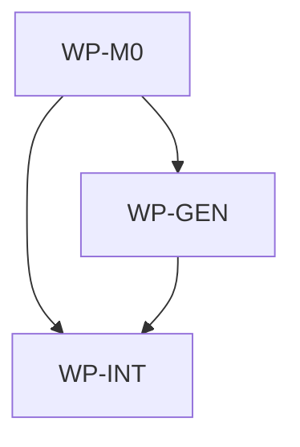

# Scope-aware spec roots

## Context

AIDLC governance can be initialized in a repository root or in any nested directory. Today the
workflow language assumes that medium and large specs are always drafted under the invocation
root's `docs/spec/` directory. That breaks nested governance ownership: a prompt started from a
parent AIDLC root can span files below subdirectories that have their own initialized AIDLC payloads,
and those subdirectories should own their local planning artifacts instead of being governed by a
parent spec.

## Goal

Make medium and large spec ownership resolve to the nearest relevant initialized AIDLC scope for
each affected path, while preserving fallback to the invocation root for paths without a nested
AIDLC initialization.

## Non-goals

- Adding a new CLI command that automatically creates or routes specs.
- Copying repository-local in-flight specs into initialized consumer repositories.
- Changing the public payload allowlist model or allowing broad `docs/**` copying.
- Changing trivial or small implementation routing beyond referencing the same scope concepts when
  blueprint sanity checks touch nested initialized roots.
- Creating an ADR; this changes workflow guidance and generated text, not the CLI distribution or
  layer architecture decision.

## Constraints

- The invocation root is the AIDLC root from which the current agent session or prompt was started.
- An AIDLC scope root is a directory at or below the invocation root that contains the initialized
  governance payload needed to own specs: `.ai/README.md` and `docs/spec/README.md`. Generated IDE
  files such as `AGENTS.md`, `.codex/**`, `.cursor/**`, or `CLAUDE.md` are not scope markers.
- For each affected file path, resolve its owning scope by walking from the file's directory upward
  to the invocation root and selecting the nearest AIDLC scope root. If no nested scope is found,
  use the invocation root.
- A path outside the invocation root is outside this workflow unless the user explicitly changes
  the invocation scope or starts a separate governed session there.
- A medium or large request that maps affected paths to more than one scope must produce one draft
  spec per resolved scope. Each scoped spec may include only affected files owned by that scope.
- A parent scoped spec must not claim ownership of files under a nested initialized AIDLC scope.
- A single approval brief may summarize multiple scoped draft specs for one user request, but
  implementation and review must treat each approved spec file as a governing artifact.
- Existing single-scope behavior remains unchanged: the spec path is still
  `docs/spec/<epoch>-<slug>.md` relative to the resolved owning scope.
- Public payload membership remains controlled by `.ai/template-manifest.yaml`. `docs/spec/README.md`
  remains public only because it is explicitly allowlisted; `docs/spec/[0-9]*-*.md` remains excluded.
- All validation and generation must run through Makefile targets.

## Affected files

- `.ai/README.md`
- `.ai/personas/architect.md`
- `.ai/personas/implementer.md`
- `.ai/personas/reviewer.md`
- `.ai/skills/classify-change.md`
- `.ai/skills/orchestrate-spec.md`
- `.ai/templates/spec.md`
- `.ai/templates/approval-brief.md`
- `.ai/scripts/ai_init.sh`
- `docs/spec/README.md`
- `docs/blueprints/template-payload.md`
- `docs/blueprints/aidlc.md`
- `aidlc/internal/generator/render.go`
- `aidlc/internal/generator/generator_test.go`

## Work packages

| ID | Title | Domain | Layer | Wave | Depends on | Parallel? |
| --- | --- | --- | --- | --- | --- | --- |
| WP-M0 | Scope-resolution governance contract | software | contracts | 0 | - | alone |
| WP-GEN | Generated IDE guidance parity | software | application | 1 | WP-M0 | alone |
| WP-INT | Blueprint sync and aggregate validation | software | integration | 2 | WP-M0, WP-GEN | alone |

## Dependency tree

## Parallel execution plan

| Wave | Work packages | Max parallel implementers |
| --- | --- | --- |
| 0 | WP-M0 | 1 |
| 1 | WP-GEN | 1 |
| 2 | WP-INT | 1 |

## Blueprint deltas

- **`docs/blueprints/template-payload.md` § Public Payload Contract**: document that public
  governance guidance and the starter `docs/spec/README.md` define scope-aware spec ownership, while
  numbered in-flight specs remain repository-local and excluded from payload copying.
- **`docs/blueprints/template-payload.md` § Update Semantics**: clarify that updating the payload
  may update the scope-resolution guidance in initialized roots but must not move, delete, or import
  local scoped specs.
- **`docs/blueprints/template-payload.md` § Test Gates**: include validation expectations for
  preserving the explicit `docs/spec/README.md` include and numbered spec exclusions after the
  workflow contract changes.
- **`docs/blueprints/aidlc.md` § Cross-package Contracts**: document that native IDE generation
  emits generated governance guidance whose spec-gate text follows the portable scope-resolution
  contract for nested initialized roots.
- **`docs/blueprints/aidlc.md` § Test Gates**: add coverage expectations for rendered guidance
  parity between Bash compatibility generation and native Go generation where hardcoded spec-gate
  text exists.

## Test plan

- `make validate-governance` - verifies architecture files, blueprint files, manifest exclusions,
  and template payload boundaries still hold after the workflow guidance changes.
- `make init all` - regenerates IDE projections from `.ai/` and confirms generated surfaces are
  produced through the supported Makefile path after changing portable guidance.
- `aidlc/internal/generator/generator_test.go` via `make aidlc-test` - covers the updated generated
  Cursor governance rule or equivalent rendered invariants so Bash and Go generator text do not
  diverge on scope-aware spec ownership.
- `make test` - runs aggregate governance validation and Go tests after blueprint sync.

## Open questions

- None.

## Implementation notes

- None yet.
