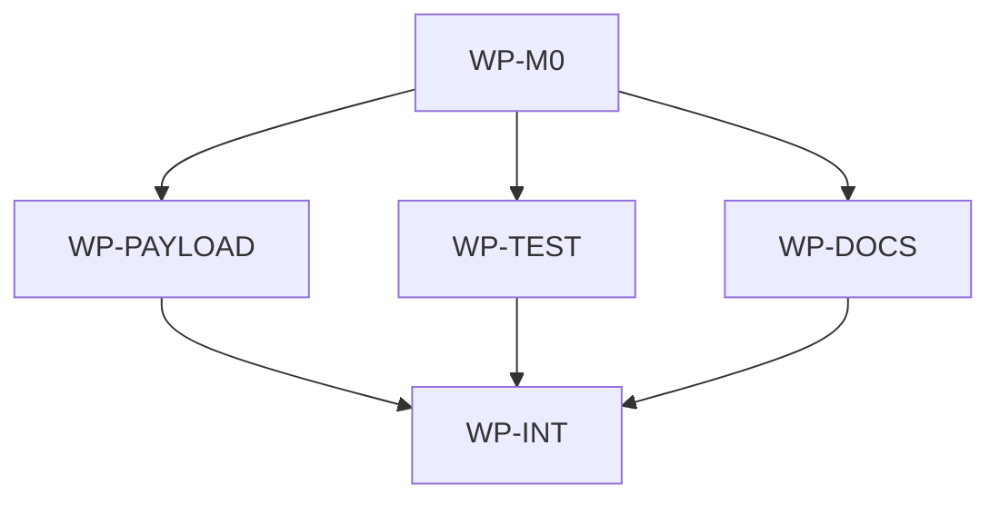

# Retire Bash Compatibility

## Context

The native Go `aidlc` CLI now supports manifest-aware generation and update flows across Windows,
macOS, and Linux. The repository still carries `.ai/scripts/ai_init.sh`, `.ai/scripts/ai_update.sh`,
Makefile Bash invocations, compatibility tests, payload manifest entries, and documentation from the
rollout period. Keeping those surfaces now preserves an obsolete public contract and requires
ongoing Bash parity work even though the CLI owns the supported behavior.

## Goal

Ship a single supported init/update path backed by the native `aidlc` CLI, while retaining the root
Makefile as the repository execution entrypoint through thin `make init` and `make update` wrappers.

## Non-goals

- Removing `.ai/scripts/finalize_spec.sh`; post-merge spec finalization remains a separate
  governance maintenance flow.
- Removing the root `Makefile` or changing the repository rule that supported commands execute
  through Makefile targets.
- Removing legacy `.aidlc/manifest.json` read fallback from native `aidlc update`.
- Changing supported IDE identifiers, generated IDE file formats, installer scripts, release asset
  layout, or GitHub source defaults.
- Deleting generated IDE artifacts unless regeneration is required by the approved wrapper behavior.

## Constraints

- This spec owns only the root AIDLC scope at `/Users/shubhangtiwari/git/aidlc`.
- The existing accepted ADR promises Make/Bash compatibility, so implementation must add a new ADR
  and update or cross-reference the existing ADR before deleting compatibility files.
- The root Makefile remains the least surprising supported execution entrypoint for this repository;
  therefore `make init <ide>` and `make update` should remain available as native CLI wrappers
  instead of being removed outright.
- Normal `aidlc init` and `aidlc update` flows must continue to avoid shelling out to Bash, Make,
  rsync, or git.
- Public payload membership remains an explicit allowlist in `.ai/template-manifest.yaml`.
- No work package in the same wave may write the same file.

## Affected files

- `docs/spec/1780458611-retire-bash-compatibility.md`
- `docs/adr/1780458611-retire-bash-compatibility.md`
- `docs/adr/1780346463-aidlc-cli-distribution-and-sync.md`
- `docs/ARCHITECTURE.md`
- `docs/blueprints/aidlc.md`
- `docs/blueprints/template-payload.md`
- `.ai/template-manifest.yaml`
- `Makefile`
- `.ai/scripts/ai_init.sh`
- `.ai/scripts/ai_update.sh`
- `.ai/README.md`
- `.ai/models.defaults.toml`
- `README.md`
- `aidlc/README.md`
- `aidlc/internal/compat/make_test.go`
- `aidlc/internal/commands/init_test.go`
- `aidlc/internal/commands/update_test.go`
- `aidlc/internal/generator/generator_test.go`
- `aidlc/internal/integration/init_update_test.go`
- `AGENTS.md`
- `.codex/agents/architect.toml`
- `.codex/agents/implementer.toml`
- `.codex/agents/reviewer.toml`
- `.codex/skills/classify-change/SKILL.md`
- `.codex/skills/init-architecture/SKILL.md`
- `.codex/skills/orchestrate-spec/SKILL.md`
- `aidlc.lock.json`

## Work packages

| ID | Title | Domain | Layer | Wave | Depends on | Parallel? |
| --- | --- | --- | --- | --- | --- | --- |
| WP-M0 | Compatibility contract and decision | software | contracts | 0 | - | alone |
| WP-PAYLOAD | Remove shell init/update payload | software | contracts | 1 | WP-M0 | with WP-TEST, WP-DOCS |
| WP-TEST | Replace compatibility tests with native coverage | software | test-support | 1 | WP-M0 | with WP-PAYLOAD, WP-DOCS |
| WP-DOCS | User-facing command documentation | software | interface | 1 | WP-M0 | with WP-PAYLOAD, WP-TEST |
| WP-INT | Integration gates and generated-surface sync | software | interface | 2 | WP-PAYLOAD, WP-TEST, WP-DOCS | alone |

## Dependency tree

## Parallel execution plan

| Wave | Work packages | Max parallel implementers |
| --- | --- | --- |
| 0 | WP-M0 | 1 |
| 1 | WP-PAYLOAD, WP-TEST, WP-DOCS | 3 |
| 2 | WP-INT | 1 |

## Blueprint deltas

- **`docs/blueprints/aidlc.md` § Cross-package Contracts**: remove Bash `make init` compatibility
  as a CLI-adjacent contract; document native `aidlc init/update` plus Makefile wrappers.
- **`docs/blueprints/aidlc.md` § Integration Boundaries**: remove Bash compatibility generation and
  update surfaces; keep GitHub archives, installers, and local-source mode.
- **`docs/blueprints/aidlc.md` § Test Gates**: replace Bash parity coverage requirements with
  native CLI and Makefile-wrapper coverage.
- **`docs/blueprints/template-payload.md` § Package Purpose**: remove "compatibility tooling" from
  the list of public payload consumers.
- **`docs/blueprints/template-payload.md` § Public Payload Contract**: document that init/update
  shell scripts are no longer public payload entries.
- **`docs/blueprints/template-payload.md` § Read-only Paths**: clarify that CLI implementation and
  retired compatibility files are not public payload.
- **`docs/blueprints/template-payload.md` § Update Semantics**: describe updates through native
  `aidlc update` instead of shell sync.

## Test plan

- `make validate-governance` - confirms architecture, ADR, blueprint, and manifest invariants match
  the retired compatibility contract and exercises native Makefile wrapper dry-run paths for
  `make init ... --dry-run` and `make update ... --dry-run`.
- `make aidlc-test` - runs native CLI and sync tests without requiring Bash compatibility parity.
- `make test` - runs the aggregate governance and Go test gates after all file removals and docs
  updates, including the Makefile-wrapper smoke coverage from validation or equivalent tests.
- `make aidlc-release-check` - confirms release packaging and installers still validate after the
  public payload no longer contains init/update shell scripts.

## Risks

- Existing users with only Bash/Make and no installed `aidlc` binary will lose the shell-only
  init/update path. Mitigate by documenting native installation and making Makefile wrappers call
  the CLI clearly.
- Target repositories that already contain `.ai/scripts/ai_init.sh` or `.ai/scripts/ai_update.sh`
  will not have those files blindly deleted by `aidlc update`. Mitigate by documenting the contract
  change and relying on manifest-aware update reporting for removed upstream files.
- Generated IDE comments currently mention `make init <ide>` as the regeneration command. This
  remains acceptable if Makefile wrappers survive; if implementation removes wrappers instead, the
  spec must be amended before approval.
- Removing Bash parity tests may hide generator drift if native tests are not strengthened. Mitigate
  by replacing parity assertions with native generator and integration scenarios before deleting the
  compat package.

## Open questions

- None.

## Implementation notes

- 2026-06-03: The Makefile-wrapper approach is intentional. It retires Bash script compatibility
  without surprising this repository's "execute through Makefile" governance rule.
- 2026-06-03: Reviewer-driven amendment adds `aidlc.lock.json` to WP-INT so the root lock can drop
  retired script entries, and makes Makefile-wrapper dry-run smoke coverage explicit in validation
  and aggregate gates.
