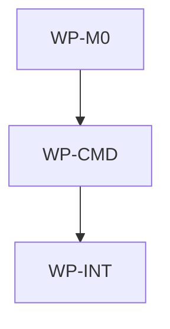

# Improve Init Conflict Output

## Context

Users saw `aidlc init` report payload conflicts and then produce neither non-conflicting payload
files nor IDE-generated files. The existing planner and copier already model init as additive and
non-destructive, but `RunInit` stops before applying the safe parts of the plan whenever any
conflict exists. The command output also reads like an internal trace (`init plan:` plus indented
reasons) instead of a concise end-user plan.

## Goal

`aidlc init` should make conflicts obvious while still applying safe payload files, generating the
requested IDE outputs, writing an honest target lock, and printing cleaner plan, written, and
generated sections.

## Non-goals

- Overwriting or auto-merging divergent local files.
- Changing `aidlc update` conflict behavior; update still writes, regenerates, and rewrites the lock
  only after a conflict-free non-dry-run plan.
- Adding color, terminal-width layout, interactive prompts, or machine-readable JSON output.
- Changing supported IDE identifiers, generator templates, or source fetching.
- Deleting local files that are unknown, conflicted, or removed upstream.

## Constraints

- This spec owns only the root AIDLC scope at `/Users/shubhangtiwari/git/aidlc`.
- Normal `aidlc init` and `aidlc update` flows must not shell out to Bash, Make, rsync, or git.
- Public payload membership remains controlled by `.ai/template-manifest.yaml`; this change must not
  infer broad directory membership.
- Reference architecture payload membership must be added as explicit file entries, not as a broad
  `.ai/references/architectures/**` include, because broad directory copying remains forbidden.
- Conflicts continue to map to exit code `1`; usage, source, fetch, manifest, and write errors
  continue to map to exit code `2`.
- Dry-run remains strictly read-only.
- Partial init locks must not claim a conflicted local file matches upstream. Only accepted upstream
  payload files may be recorded in `aidlc.lock.json`.
- IDE generation during partial init uses the target repository state after safe payload writes:
  newly created files plus any existing local files left in place because they conflicted.
- Output must remain plain text and deterministic. Use one stable glyph before each header, no ANSI
  color, and no multi-line per-row comments.
- Header glyphs are exactly `◆ plan`, `✓ written`, and `✦ generated`.
- Header labels are exactly `plan`, `written`, and `generated`; the command mode (`init` or
  `update`) is not prefixed to the header.
- Plan rows print exactly `<decision-state> <path> <reason>`. Written rows print exactly
  `write <path> <comment>`. Generated rows print exactly `generate <path> <comment>`.
- No work package in the same wave may write the same file.

## Affected files

- `docs/spec/1780498845-improve-init-conflict-output.md`
- `.ai/template-manifest.yaml`
- `aidlc/internal/sync/manifest_store.go`
- `aidlc/internal/sync/manifest_store_test.go`
- `aidlc/internal/commands/init.go`
- `aidlc/internal/commands/init_test.go`
- `aidlc/internal/commands/update_test.go`
- `aidlc/internal/integration/init_update_test.go`
- `aidlc/README.md`
- `docs/blueprints/aidlc.md`
- `docs/blueprints/template-payload.md`

## Work packages

| ID | Title | Domain | Layer | Wave | Depends on | Parallel? |
| --- | --- | --- | --- | --- | --- | --- |
| WP-M0 | Partial init lock contract | software | application | 0 | - | alone |
| WP-CMD | Init conflict behavior and CLI output | software | application | 1 | WP-M0 | alone |
| WP-INT | Integration coverage, reference payload, and blueprint sync | software | integration | 2 | WP-CMD | alone |

## Dependency tree

## Parallel execution plan

| Wave | Work packages | Max parallel implementers |
| --- | --- | --- |
| 0 | WP-M0 | 1 |
| 1 | WP-CMD | 1 |
| 2 | WP-INT | 1 |

## Blueprint deltas

- **`docs/blueprints/template-payload.md` § Public Payload Contract**: add reference architecture
  profiles under `.ai/references/architectures/**` as intentional public payload because
  `init-architecture` depends on them in initialized repositories.
- **`docs/blueprints/aidlc.md` § Cross-package Contracts**: update `aidlc init` to state that
  conflicts exit `1` but do not block safe create/skip payload decisions, requested IDE generation,
  or root lock writing.
- **`docs/blueprints/aidlc.md` § Owned State**: clarify that partial init writes `aidlc.lock.json`
  only for accepted upstream payload files plus generation/workspace metadata, and excludes
  conflicted payload paths from tracked clean file entries.
- **`docs/blueprints/aidlc.md` § Integration Boundaries**: distinguish init partial-apply conflict
  behavior from update's conflict-free-only regeneration and lock rewrite behavior.
- **`docs/blueprints/aidlc.md` § Test Gates**: add coverage expectations for partial init conflicts,
  honest partial locks, unchanged update conflict behavior, and formatted CLI result output.
- **`docs/blueprints/template-payload.md` § Update Semantics**: refine init semantics from
  "create missing files, skip identical files, and report conflicts" to explicitly say init applies
  non-conflicting payload decisions even when other payload paths conflict, without overwriting
  divergent local files.

## Test plan

- `aidlc/internal/sync/manifest_store_test.go` - partial init manifest construction includes
  created and skipped upstream payload files, excludes conflicted payload files, preserves upstream
  checksums/modes for recorded files, and leaves existing full-plan clean update manifest behavior
  unchanged.
- `aidlc/internal/commands/init_test.go` - `RunInit` with one conflicted payload path still writes
  other create decisions, leaves the conflicted file untouched, generates the requested IDE files,
  writes `aidlc.lock.json`, records the requested workspace IDEs, and omits the conflicted payload
  path from tracked files.
- `aidlc/internal/commands/init_test.go` - dry-run with conflicts stays read-only and reports the
  plan without written/generated files.
- `aidlc/internal/commands/init_test.go` - `RunInitCLI` with conflicts returns exit code `1` and
  stdout contains icon-prefixed `plan`, `written`, and `generated` headers when writes/generation
  occurred.
- `aidlc/internal/commands/init_test.go` - output rows are single-line
  `<action> <filename> <comment>` entries and no longer include `init plan:`, `init dry run:`, or
  indented reason lines.
- `aidlc/internal/commands/update_test.go` - shared output formatting applies to update results
  without changing update's existing conflict behavior.
- `aidlc/internal/integration/init_update_test.go` - full CLI init with a conflicted public payload
  file exits `1`, writes safe public payload files, generates the requested IDE surfaces, writes the
  root lock honestly, and still excludes private source paths.
- `aidlc/internal/integration/init_update_test.go` - public payload fixtures include the reference
  architecture profiles from `.ai/references/architectures/**`, and init/update integration tests
  prove those files are written while repository-local architecture docs remain excluded.
- `make aidlc-test` - command, sync, and integration tests for the isolated Go module.
- `make test` - aggregate validation and Go test gate after README and blueprint updates.
- `make validate-governance` - blueprint and governance invariants remain consistent.

## Risks

- Writing `aidlc.lock.json` during a conflicted init could be misleading if conflicted files were
  recorded as clean. Mitigate by adding a partial manifest path that excludes conflicted payload
  entries.
- Generated IDE files may reflect local conflicted governance files rather than upstream versions.
  This is expected because init must not overwrite local edits; the plan keeps those conflicts
  visible for follow-up.
- Output changes may affect consumers scraping human text. Mitigate by keeping exit codes stable and
  documenting the new human-readable shape in `aidlc/README.md`.

## Open questions

- None.

## Implementation notes

- Filled during execution. Amendments and discoveries go here with date and justification.
