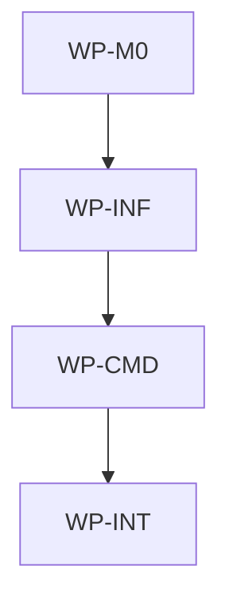

# Add Upgrade Command

## Context

Users can install AIDLC from GitHub release assets, but once a binary is installed there is no native
CLI command for moving that installation to the latest release. Adding `aidlc upgrade` changes the
public command contract and brings release lookup, asset download, checksum verification, archive
extraction, and binary replacement into the install surface already described by the accepted CLI
distribution ADR.

## Goal

`aidlc upgrade` should upgrade the currently installed AIDLC CLI to the latest GitHub release using
native Go release download and checksum-verified binary replacement.

## Non-goals

- Changing `aidlc init`, `aidlc update`, or `aidlc version` behavior.
- Changing the release asset naming scheme, checksum file format, release workflow tag format, or
  installer script contract.
- Adding package-manager integration such as Homebrew, npm, Scoop, apt, or winget.
- Adding interactive prompts, colorized output, progress bars, or machine-readable JSON output.
- Updating governance payload files in target repositories; `upgrade` changes only the installed
  CLI binary.

## Constraints

- This spec owns only the root AIDLC scope at `/Users/shubhangtiwari/git/aidlc`; it must not claim
  files below a nested initialized AIDLC scope.
- Layer rules from `docs/architecture/software.md` apply: CLI argument parsing stays in
  `aidlc/internal/cli` and command-facing orchestration in `aidlc/internal/commands`; release HTTP,
  checksum, extraction, and install operations stay in `aidlc/internal/install`.
- The root repository must not gain root-level Go manifests or Go dependencies.
- The command must use native Go filesystem, archive, checksum, and HTTP behavior. It must not call
  Bash, Make, rsync, git, curl, tar, zip, or PowerShell to perform the upgrade.
- Default release lookup uses `shubhangtiwari/aidlc`; `--repo owner/repo` exists for tests,
  forks, and development release checks.
- Default version selector is `latest`. Explicit selectors accept `vX.Y.Z` and `aidlc/vX.Y.Z` and
  normalize to the `aidlc version` output format, which is `vX.Y.Z` for released binaries.
- Existing release assets are the source of truth: `aidlc_<os>_<arch>.tar.gz` for Darwin/Linux,
  `aidlc_windows_<arch>.zip` for Windows, and `checksums.txt`.
- If the current version already equals the resolved latest version and the user did not explicitly
  request a concrete version reinstall, `upgrade` exits `0` without writing.
- Dry-run must not download archives, extract files, or write to the install destination.
- No work package in the same wave may write the same file.

## Affected files

- `docs/spec/1780503472-add-upgrade-command.md`
- `aidlc/internal/contract/options.go`
- `aidlc/internal/install/platform.go`
- `aidlc/internal/install/platform_test.go`
- `aidlc/internal/install/upgrade.go`
- `aidlc/internal/install/upgrade_test.go`
- `aidlc/internal/commands/upgrade.go`
- `aidlc/internal/commands/upgrade_test.go`
- `aidlc/internal/cli/root.go`
- `aidlc/internal/cli/root_test.go`
- `aidlc/scripts/verify-release.sh`
- `aidlc/README.md`
- `docs/blueprints/aidlc.md`

## Work packages

| ID | Title | Domain | Layer | Wave | Depends on | Parallel? |
| --- | --- | --- | --- | --- | --- | --- |
| WP-M0 | Upgrade command contract and release asset helpers | software | contracts | 0 | - | alone |
| WP-INF | Native GitHub release download and binary replacement | software | infrastructure | 1 | WP-M0 | alone |
| WP-CMD | Upgrade command orchestration and CLI wiring | software | interface | 2 | WP-INF | alone |
| WP-INT | Documentation, release smoke, and blueprint sync | software | integration | 3 | WP-CMD | alone |

## Dependency tree

## Parallel execution plan

| Wave | Work packages | Max parallel implementers |
| --- | --- | --- |
| 0 | WP-M0 | 1 |
| 1 | WP-INF | 1 |
| 2 | WP-CMD | 1 |
| 3 | WP-INT | 1 |

## Blueprint deltas

- **`docs/blueprints/aidlc.md` § Cross-package Contracts**: add `aidlc upgrade [--repo owner/repo]
  [--version latest|TAG] [--install-dir DIR] [--dry-run]`, including default latest-release
  behavior, version normalization, exit codes, and deterministic output.
- **`docs/blueprints/aidlc.md` § Owned State**: record that `upgrade` may write the installed
  `aidlc` executable at the resolved install destination and uses temporary staging files during
  replacement, but does not modify target repository payload state or `aidlc.lock.json`.
- **`docs/blueprints/aidlc.md` § Integration Boundaries**: add native GitHub release metadata and
  release asset downloads as a CLI integration boundary, reusing `checksums.txt` verification and
  the existing release artifact naming scheme.
- **`docs/blueprints/aidlc.md` § Test Gates**: add expectations for release asset selection,
  checksum verification, dry-run behavior, already-latest no-op behavior, command help, root CLI
  routing, and packaged-binary help smoke coverage.

## Test plan

- `aidlc/internal/install/platform_test.go` - supported OS/architecture combinations map to the
  existing release archive names, and unsupported values fail before network or filesystem writes.
- `aidlc/internal/install/upgrade_test.go` - release metadata parsing resolves latest and explicit
  tags, normalizes `aidlc/vX.Y.Z` to `vX.Y.Z`, selects the matching asset and checksums asset, and
  rejects missing or malformed assets.
- `aidlc/internal/install/upgrade_test.go` - archive downloads verify SHA-256 using the existing
  checksum parser before extraction, and checksum mismatches prevent destination writes.
- `aidlc/internal/install/upgrade_test.go` - successful installs stage and replace a target binary
  in a temporary install directory without invoking external tools.
- `aidlc/internal/install/upgrade_test.go` - dry-run returns the planned release, asset, and
  destination without downloading archives or writing files.
- `aidlc/internal/commands/upgrade_test.go` - command help, unexpected arguments, flag parsing,
  unsupported platform errors, already-latest no-op, explicit version reinstall, dry-run, and
  successful install paths return the expected exit codes and deterministic stdout/stderr.
- `aidlc/internal/cli/root_test.go` - root dispatch routes `upgrade`, root help lists it, and
  unknown-command behavior remains unchanged.
- `aidlc/scripts/verify-release.sh` - packaged release binary still reports the injected version and
  now also exposes `aidlc upgrade --help`.
- `make aidlc-test` - command, install, and root CLI unit coverage for the isolated Go module.
- `make aidlc-release-check` - release asset packaging and packaged-binary smoke checks.
- `make test` and `make validate-governance` - aggregate governance, blueprint, and Go test gates.

## Risks

- Replacing the currently running executable is platform-sensitive, especially on Windows. Mitigate
  by keeping replacement logic inside `aidlc/internal/install`, testing staged replacement in
  temporary directories, and using a native Windows staging flow rather than shelling out.
- GitHub release API or asset download failures could be confused with usage errors. Mitigate with
  deterministic `aidlc upgrade:` error messages and exit code `2` for all non-conflict command
  failures.
- Forks and development checkouts may not use the default upstream repository or may run from
  unwritable directories. Mitigate with `--repo`, `--install-dir`, and dry-run support.

## Open questions

- None.

## Implementation notes

- Filled during execution. Amendments and discoveries go here with date and justification.
