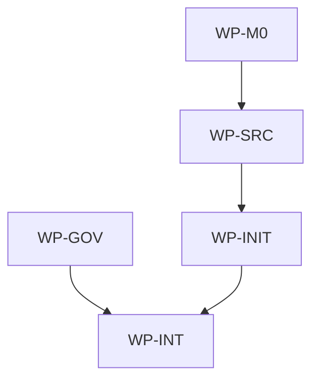

# Init License And Tier Classification

## Context

`aidlc init` currently treats every public template manifest include as both the source repository
path and the target repository path. Because the repository `LICENSE` is listed as public payload,
init plans it at target root `LICENSE`, where it can conflict with the consumer repository's own
license. The requested behavior is to install AIDLC's license under a namespaced path instead:
`licenses/aidlc.md`.

The same change set will also refine governance tier classification. The existing guidance makes
"more than one file" read like an automatic medium-tier trigger, but low-risk mechanical or bounded
changes can reasonably remain small even when they touch multiple files. Tiering should focus on
semantic risk and contract impact, while still using file count and line count as evidence to
inspect.

## Goal

`aidlc init` and the manifest-aware payload pipeline should copy this repository's root `LICENSE`
content into target `licenses/aidlc.md`, leaving any consumer root `LICENSE` untouched and untracked
by AIDLC, and the governance tier rules should classify changes by behavioral and coordination risk
rather than raw file count alone.

## Non-goals

- Changing this repository's root `LICENSE` content or license terms.
- Copying, deleting, or rewriting a consumer repository's root `LICENSE`.
- Adding a broad `licenses/**` payload directory or copying arbitrary license files.
- Migrating or deleting an already-tracked historical target root `LICENSE`; update should report it
  as removed upstream and leave the local file alone.
- Changing supported IDEs, generated IDE output, CLI flags, or source fetching choices.
- Introducing shell, Make, rsync, or git calls into normal init/update flows.
- Removing the spec gate for changes that affect contracts, target state, integrations, topology,
  persistence, or public behavior.
- Defining a numeric line-count threshold that bypasses judgment; small line counts remain only one
  signal among others.

## Constraints

- This spec owns only the root AIDLC scope at `/Users/shubhangtiwari/git/aidlc`; all affected paths
  are owned by that scope.
- Normal `aidlc init` and `aidlc update` flows must use native Go filesystem, archive, checksum,
  and rendering logic.
- Public payload membership remains controlled by `.ai/template-manifest.yaml`; no implementation
  may infer broad directory membership.
- Existing same-path manifest includes must remain compatible.
- The new mapped include form must be explicit and limited to single-file source and target paths.
- Both source and target paths must pass payload path normalization; absolute paths, parent
  traversal, empty paths, Windows drive paths, duplicate target paths, private target paths, and
  broad target globs are invalid.
- The planner and target manifest use destination paths. For this change, decisions, writes, and
  `aidlc.lock.json` should use `licenses/aidlc.md`, not `LICENSE`.
- Update remains checksum-aware and non-deleting: a previously tracked `LICENSE` that is no longer
  in the upstream target set is reported as removed upstream and is not deleted.
- No work package in the same wave writes the same file.
- No new ADR is required unless implementation discovers a broader manifest schema decision than the
  explicit single-file source-to-target mapping described here.
- Tier guidance must keep the current governed workflow intact: trivial/small still require triage,
  inline intent, user confirmation, and implementer delegation; medium/large/uncertain still require
  an approved spec.
- Classification examples must make clear that file count and line count are evidence, not hard
  gates. Multi-file can be small when risk is low; one-file can be medium when contract or state
  semantics change.

## Affected files

- `.ai/template-manifest.yaml`
- `.ai/README.md`
- `.ai/skills/classify-change.md`
- `aidlc/internal/contract/manifest.go`
- `aidlc/internal/source/source.go`
- `aidlc/internal/source/source_test.go`
- `aidlc/internal/source/local.go`
- `aidlc/internal/source/archive.go`
- `aidlc/internal/integration/windows_paths_test.go`
- `aidlc/internal/sync/planner_test.go`
- `aidlc/internal/commands/init_test.go`
- `aidlc/internal/commands/update_test.go`
- `aidlc/internal/integration/init_update_test.go`
- `docs/spec/README.md`
- `docs/blueprints/aidlc.md`
- `docs/blueprints/template-payload.md`

## Work packages

| ID | Title | Domain | Layer | Wave | Depends on | Parallel? |
| --- | --- | --- | --- | --- | --- | --- |
| WP-M0 | Manifest source-to-target payload contract | software | contracts | 0 | - | parallel with WP-GOV |
| WP-GOV | Tier classification guidance refinement | software | contracts | 0 | - | parallel with WP-M0 |
| WP-SRC | Provider snapshots emit destination paths | software | infrastructure | 1 | WP-M0 | alone |
| WP-INIT | Init and update payload behavior | software | application | 2 | WP-SRC | alone |
| WP-INT | Blueprint sync and aggregate gates | software | integration | 3 | WP-GOV, WP-INIT | alone |

## Dependency tree

## Parallel execution plan

| Wave | Work packages | Max parallel implementers |
| --- | --- | --- |
| 0 | WP-M0, WP-GOV | 2 |
| 1 | WP-SRC | 1 |
| 2 | WP-INIT | 1 |
| 3 | WP-INT | 1 |

## Blueprint deltas

- **`docs/blueprints/template-payload.md` § Public Payload Contract**: document that manifest
  includes may be same-path entries or explicit single-file source-to-target entries, and that the
  public license payload reads from repository `LICENSE` while installing to `licenses/aidlc.md`.
- **`docs/blueprints/template-payload.md` § Update Semantics**: clarify that payload planning,
  checksum comparison, writes, and target manifest tracking use destination paths; historical
  tracked paths removed from the destination set are reported as removed upstream and not deleted.
- **`docs/blueprints/template-payload.md` § Test Gates**: add validation coverage for mapped
  manifest entries, path normalization, private path rejection, and no broad license directory copy.
- **`docs/blueprints/template-payload.md` § Public Payload Contract**: document that public
  governance guidance now defines tier classification by semantic risk and contract impact rather
  than making multi-file changes automatically medium.
- **`docs/blueprints/template-payload.md` § Update Semantics**: note that payload updates may
  refresh tier-classification guidance in `.ai/**` and `docs/spec/README.md` without changing local
  repository specs.
- **`docs/blueprints/aidlc.md` § Cross-package Contracts**: update `aidlc init` and `aidlc update`
  contracts to state that AIDLC's license is tracked as `licenses/aidlc.md`, preserving consumer
  root `LICENSE`.
- **`docs/blueprints/aidlc.md` § Owned State**: add `licenses/aidlc.md` to target repository state
  owned by AIDLC and clarify that root `LICENSE` is not owned by AIDLC after this change.
- **`docs/blueprints/aidlc.md` § Integration Boundaries**: state that local and GitHub/archive
  providers may read a source payload path that differs from the target path, while normal flows
  still avoid shelling out.
- **`docs/blueprints/aidlc.md` § Test Gates**: add init/update coverage for license relocation,
  root license preservation, mapped target lock entries, and historical `LICENSE` update behavior.

## Test plan

- `aidlc/internal/source/source_test.go` - parse and validate same-path include entries plus mapped
  entries such as `LICENSE -> licenses/aidlc.md`; reject invalid source paths, invalid target paths,
  duplicate target paths, private targets, broad targets, and unmapped snapshot files.
- `aidlc/internal/source/source_test.go` - local and archive snapshots read the root `LICENSE`
  source file and emit a file whose path is `licenses/aidlc.md` with the original content and mode.
- `aidlc/internal/integration/windows_paths_test.go` - mapped source and target paths with Windows
  separators normalize to slash-separated target lock entries.
- `aidlc/internal/sync/planner_test.go` - init planning creates `licenses/aidlc.md`; a divergent
  root `LICENSE` is ignored by payload conflict detection, while a divergent `licenses/aidlc.md`
  conflicts.
- `aidlc/internal/commands/init_test.go` - `RunInit` writes `licenses/aidlc.md`, leaves consumer
  root `LICENSE` unchanged, generates requested IDE files, and records only `licenses/aidlc.md` in
  `aidlc.lock.json`.
- `aidlc/internal/commands/init_test.go` - dry-run reports the `licenses/aidlc.md` plan without
  writing payload files, generated IDE files, or the lock.
- `aidlc/internal/commands/init_test.go` - a divergent target `licenses/aidlc.md` remains
  untouched, produces the existing conflict behavior, and is omitted from a partial init lock.
- `aidlc/internal/commands/update_test.go` - update from an older manifest that tracked `LICENSE`
  reports root `LICENSE` as removed upstream, does not delete it, and creates or updates
  `licenses/aidlc.md`.
- `.ai/skills/classify-change.md`, `.ai/README.md`, and `docs/spec/README.md` - documentation
  examples distinguish low-risk multi-file small changes from medium contract/state/topology changes
  and clarify that file count is a signal, not an automatic tier.
- `aidlc/internal/integration/init_update_test.go` - end-to-end local-source init and update
  fixtures prove the license relocation, root license preservation, target lock path, and private
  path exclusions.
- `make aidlc-test` - Go unit and integration tests for the isolated CLI module.
- `make validate-governance` - manifest and governance invariants after changing the public payload
  manifest.
- `make test` - aggregate repository gate after code, tests, manifest, and blueprint edits.

## Open questions

- None.

## Implementation notes

- None yet.
