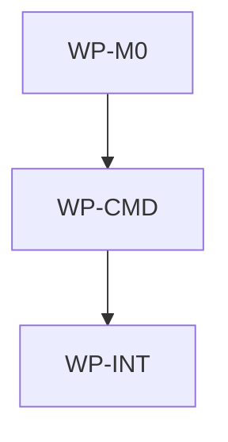

# Add Force To Init And Update

## Context

`aidlc init` and `aidlc update` currently preserve divergent local payload files by reporting
conflicts and, for update, blocking payload writes, IDE regeneration, and lock rewrite until the
conflict is resolved. Users need an explicit escape hatch for repositories where replacing local
governance payload files with the selected upstream is intentional. That escape hatch changes the
public command contract, target repository state semantics, exit behavior, documentation, and tests.

## Goal

`aidlc init --force` and `aidlc update --force` should overwrite divergent manifest-managed payload
files with upstream content, report those planned writes as overwrites, and complete successfully
when no non-force error occurs.

## Non-goals

- Adding interactive prompts, merge behavior, backups, colorized output, or machine-readable JSON.
- Deleting local files that are removed upstream, unknown to the public payload manifest, or outside
  AIDLC payload ownership.
- Changing the public template manifest allowlist, supported IDE identifiers, source provider
  behavior, or generated IDE templates.
- Changing `aidlc upgrade`, `aidlc version`, installer scripts, or release packaging.
- Extending `--force` to overwrite target files that are not public payload destinations from
  `.ai/template-manifest.yaml`.

## Constraints

- This spec owns only the root AIDLC scope at `/Users/shubhangtiwari/git/aidlc`; it must not claim
  files below a nested initialized AIDLC scope.
- Layer rules from `docs/architecture/software.md` apply: command-facing option DTOs stay in
  `aidlc/internal/contract`, sync decision state and planning stay in `aidlc/internal/sync`, and
  command orchestration/help/exit behavior stay in `aidlc/internal/commands`.
- Normal `aidlc init` and `aidlc update` flows must use native Go filesystem, checksum, HTTP,
  archive, and rendering logic. They must not shell out to Bash, Make, rsync, or git.
- Public payload membership remains controlled by `.ai/template-manifest.yaml`; force must not infer
  broad directory membership or make private repository files writable.
- Forced overwrite applies only to payload decisions that would otherwise be `conflict`. It does not
  convert `removed-upstream` into deletion and does not make local-only files writable.
- Add a new deterministic decision state, printed as `overwrite`, for forced conflict bypasses.
  Forced rows must not print as `conflict`, because conflict rows keep exit code `1` semantics.
- Existing `conflict` rows remain unchanged when `--force` is not set.
- `--dry-run --force` is read-only: no payload writes, no generated IDE writes, no root lock writes,
  and no legacy manifest migration.
- Mutating forced init writes `aidlc.lock.json` and records overwritten payload paths as clean
  upstream-tracked files. The lock also records the requested concrete workspace IDEs exactly as
  existing successful init does.
- Mutating forced update writes `aidlc.lock.json` from the full accepted upstream plan, including
  overwritten payload paths as clean upstream-tracked files. When only legacy `.aidlc/manifest.json`
  exists, forced update may migrate to root `aidlc.lock.json` only during a non-dry-run mutation.
- Generated IDE behavior follows existing command rules after payload application: forced init
  generates the requested IDE surfaces; forced update regenerates only `workspace.ides`; empty
  workspace selections still generate nothing.
- Exit behavior: successful forced runs exit `0`; non-forced conflicts still exit `1`; usage,
  source, fetch, manifest, generation, lock, and write errors still exit `2`. A post-plan write or
  generation error in a forced run is not downgraded to conflict.
- No new ADR is required because this extends the existing CLI distribution and sync decision
  contract without changing layer boundaries, source integration boundaries, or durable state shape.
- No work package in the same wave may write the same file.

## Affected files

- `docs/spec/1780544854-add-force-init-update.md`
- `aidlc/internal/contract/options.go`
- `aidlc/internal/sync/conflict.go`
- `aidlc/internal/sync/planner.go`
- `aidlc/internal/sync/planner_test.go`
- `aidlc/internal/commands/init.go`
- `aidlc/internal/commands/init_test.go`
- `aidlc/internal/commands/update.go`
- `aidlc/internal/commands/update_test.go`
- `aidlc/internal/integration/init_update_test.go`
- `README.md`
- `aidlc/README.md`
- `docs/blueprints/aidlc.md`
- `docs/blueprints/template-payload.md`

## Work packages

| ID | Title | Domain | Layer | Wave | Depends on | Parallel? |
| --- | --- | --- | --- | --- | --- | --- |
| WP-M0 | Force overwrite planning contract | software | contracts | 0 | - | alone |
| WP-CMD | Init and update force flag behavior | software | application | 1 | WP-M0 | alone |
| WP-INT | Integration coverage, docs, and blueprint sync | software | integration | 2 | WP-CMD | alone |

## Dependency tree

## Parallel execution plan

| Wave | Work packages | Max parallel implementers |
| --- | --- | --- |
| 0 | WP-M0 | 1 |
| 1 | WP-CMD | 1 |
| 2 | WP-INT | 1 |

## Blueprint deltas

- **`docs/blueprints/aidlc.md` § Cross-package Contracts**: add `--force` to `aidlc init` and
  `aidlc update`, including forced overwrite semantics, dry-run force behavior, `overwrite` plan
  rows, and exit code `0` for successful forced overwrites.
- **`docs/blueprints/aidlc.md` § Owned State**: document that forced init and update may replace
  divergent public payload destination files and then track those overwritten files in
  `aidlc.lock.json`; removed-upstream files and private/local-only files remain outside forced
  deletion or overwrite behavior.
- **`docs/blueprints/aidlc.md` § Integration Boundaries**: clarify that forced update regenerates
  persisted IDE surfaces and writes/migrates the root lock only after a non-dry-run forced mutation,
  while dry-run force is fully read-only.
- **`docs/blueprints/aidlc.md` § Test Gates**: add coverage expectations for forced init, forced
  update, dry-run force, overwrite output rows, private path exclusion, lock tracking, and unchanged
  non-forced conflict behavior.
- **`docs/blueprints/template-payload.md` § Update Semantics**: add that conflicts remain
  non-destructive by default, but explicit force converts conflicting public payload destinations
  into overwrite decisions without deleting removed-upstream files.

## Test plan

- `aidlc/internal/sync/planner_test.go` - forced init plans a divergent existing payload file as
  `overwrite`, ApplyPlan replaces it with upstream content, and unforced init remains conflict-only
  for the same fixture.
- `aidlc/internal/sync/planner_test.go` - forced update plans tracked-divergent and
  untracked-existing upstream payload destinations as `overwrite`, applies both, and still leaves
  `removed-upstream` paths untouched.
- `aidlc/internal/commands/init_test.go` - `RunInit` with Force true overwrites a divergent payload
  file, writes other payload files, generates the requested IDE files, writes `aidlc.lock.json`, and
  records the overwritten path as tracked clean upstream content.
- `aidlc/internal/commands/init_test.go` - `RunInit` with DryRun and Force true reports overwrite
  decisions but leaves payload files, generated IDE files, and lock files unchanged.
- `aidlc/internal/commands/init_test.go` - `RunInitCLI` accepts `--force` before or after the IDE,
  prints `overwrite` rows instead of `conflict` rows for forced conflicts, includes help text for
  the flag, exits `0` on successful forced overwrite, and still exits `1` for non-forced conflicts.
- `aidlc/internal/commands/update_test.go` - `RunUpdate` with Force true overwrites a divergent
  tracked payload file, regenerates only the workspace IDEs, writes `aidlc.lock.json`, and exits
  cleanly through the CLI.
- `aidlc/internal/commands/update_test.go` - forced dry-run update reports overwrite decisions but
  does not write payload files, regenerate IDE files, rewrite the root lock, or migrate a legacy
  manifest.
- `aidlc/internal/commands/update_test.go` - output formatting remains deterministic and unforced
  update conflicts still prevent writes, generation, and lock rewrite.
- `aidlc/internal/integration/init_update_test.go` - full CLI forced init overwrites a divergent
  public payload file, writes safe payload files, generates requested IDE surfaces, writes an honest
  lock including the overwritten payload path, excludes private paths, and exits `0`.
- `aidlc/internal/integration/init_update_test.go` - full CLI forced update overwrites a divergent
  public payload file, regenerates selected IDE surfaces from updated payload content, updates the
  root lock to the new upstream, excludes private paths, and exits `0`.
- `aidlc/internal/integration/init_update_test.go` - full CLI `update --dry-run --force` reports
  overwrite decisions while preserving payload files, generated IDE files, root lock, and any legacy
  manifest byte-for-byte.
- `make aidlc-test` - command, sync, and integration tests for the isolated Go module.
- `make test` - aggregate governance validation and Go test gate after README and blueprint edits.
- `make validate-governance` - blueprint/spec governance invariants after documentation updates.

## Open questions

- None.

## Implementation notes

- Drafted on 2026-06-04 from main-session medium triage. The spec intentionally uses a new
  `overwrite` decision state so forced conflict bypasses are visible in the plan without retaining
  `conflict` exit semantics.
