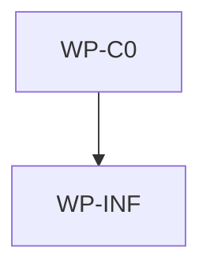

# Default Unix Installer To /usr/local/bin

## Context

The Unix shell installer currently installs `aidlc` to `$HOME/.local/bin` when `AIDLC_INSTALL_DIR`
is not set. For now, the desired public default is `/usr/local/bin`, which is more commonly present
on `PATH` but often requires elevated write permission on macOS and Linux. That changes the
distribution filesystem boundary and must be reflected in installer behavior, user docs, and the
aidlc blueprint.

## Goal

The Unix shell installer should install to `/usr/local/bin/aidlc` by default while preserving
`AIDLC_INSTALL_DIR` as the documented override for custom or user-writable install directories.

## Non-goals

- Changing the PowerShell installer default or Windows installation behavior.
- Changing `aidlc upgrade`, including its default destination of the running executable directory.
- Adding package-manager integration such as Homebrew, apt, npm, Scoop, or winget.
- Adding interactive prompts, automatic privilege escalation, or installer retry logic.
- Changing release asset naming, checksum format, or GitHub release workflow behavior.

## Constraints

- This spec owns only the root AIDLC scope at `/Users/shubhangtiwari/git/aidlc`; it must not claim
  files below a nested initialized AIDLC scope.
- Layer rules from `docs/architecture/software.md` apply: installer scripts and release validation
  are infrastructure-layer distribution surfaces.
- Repository commands must run through root `Makefile` targets.
- The shell installer must remain POSIX `sh` compatible and non-interactive.
- The installer must not call `sudo` itself. Documentation should show when users may need to run
  the install command with `sudo` for `/usr/local/bin`, and should prefer `AIDLC_INSTALL_DIR` when a
  user-writable destination is intended.
- `AIDLC_INSTALL_DIR` must keep precedence over the default so existing automation with an explicit
  install directory remains compatible.

## Affected files

- `aidlc/scripts/install.sh`
- `aidlc/scripts/verify-release.sh`
- `README.md`
- `aidlc/README.md`
- `docs/blueprints/aidlc.md`

## Work packages

| ID | Title | Domain | Layer | Wave | Depends on | Parallel? |
| --- | --- | --- | --- | --- | --- | --- |
| WP-C0 | Unix installer destination contract and docs | software | infrastructure | 0 | - | alone |
| WP-INF | Shell installer default and release verification | software | infrastructure | 1 | WP-C0 | alone |

## Dependency tree

## Parallel execution plan

| Wave | Work packages | Max parallel implementers |
| --- | --- | --- |
| 0 | WP-C0 | 1 |
| 1 | WP-INF | 1 |

## Blueprint deltas

- **`docs/blueprints/aidlc.md` § Owned State**: Record that the Unix shell installer owns only the
  installed `aidlc` executable at the resolved install directory, defaulting to
  `/usr/local/bin/aidlc` unless `AIDLC_INSTALL_DIR` is set.
- **`docs/blueprints/aidlc.md` § Integration Boundaries**: Document the Unix shell installer
  filesystem boundary: it downloads release artifacts and writes to `/usr/local/bin` by default,
  may require the user to invoke it with elevated permissions, and keeps `AIDLC_INSTALL_DIR` as the
  custom destination override.
- **`docs/blueprints/aidlc.md` § Test Gates**: Add coverage expectation that release verification
  guards the Unix installer default and override contract without network access.

## Test plan

- `make validate-governance` - confirms architecture and blueprint governance files remain valid.
- `make aidlc-release-check` - should continue to build release assets and should statically verify
  the shell installer default is `/usr/local/bin` while preserving `AIDLC_INSTALL_DIR` override
  behavior.
- `make test` - aggregate gate covering governance validation and the isolated aidlc module tests.

## Open questions

- None.

## Implementation notes

- 2026-06-04: Keep privilege handling in documentation and caller choice; the installer should not
  prompt for or invoke `sudo` internally because it is commonly run through a pipeline.
