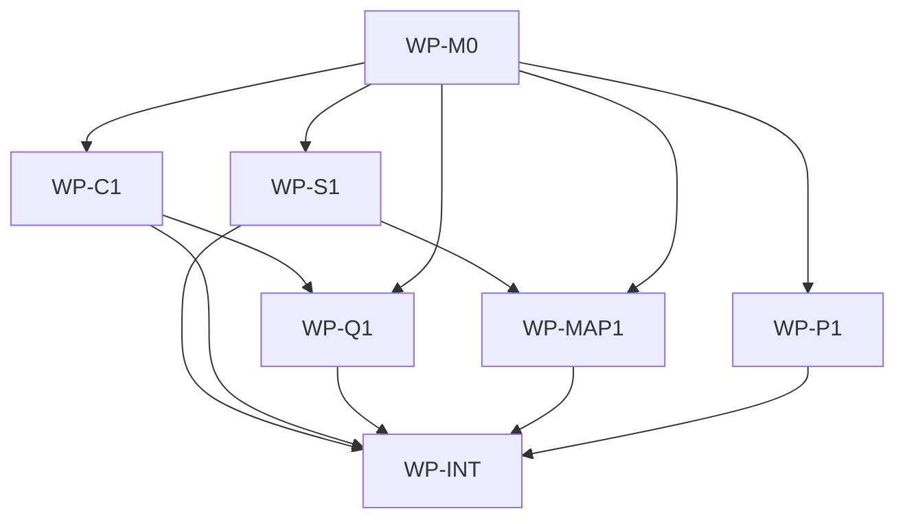

# Agent Repo-Map: Compact Navigation Index for AI Agents

## Context

AI agents working in governed repositories spend significant tokens on exploratory file reads --
scanning directory trees, opening files speculatively, and re-reading paths they have already
visited -- before they find the files relevant to a task. This token cost scales with repository
size and is purely navigational waste: the agent needs to know *where* to look, not *what* the
code says, until it is ready to edit. No existing aidlc feature provides a pre-built navigation
index that an agent can consult to skip straight to the relevant files.

## Goal

After `aidlc map` has run on a governed target repository, any AI agent can invoke `aidlc query
<search terms>` (or the equivalent `make ai-query` target) and receive a small ranked list of the
most relevant file paths, reducing exploratory reads and the associated token cost.

## Non-goals

- **Symbol-level / function-level extraction.** Tier 2 work using tree-sitter or similar parsers.
  Explicitly deferred; this spec covers Tier 1 (language-agnostic, no AST parsing) only.
- **Remote or hosted index.** The index is local, committed (JSONL) and derived (SQLite). No
  network service.
- **Automated agent integration.** The protocol doc instructs agents; wiring agents to call `aidlc
  query` automatically before every file read is out of scope.
- **Incremental update optimization.** Full regeneration is cheap at Tier 1 scale. Content hashes
  enable staleness detection; true incremental partial-shard updates are future work.
- **IDE-specific query surfaces.** No Cursor/Claude/Codex-specific integration beyond the Makefile
  include fragment and protocol doc.

## Constraints

- **Makefile-only execution (Hard Rule 2).** Target repos invoke `make ai-map` and `make ai-query`
  via an included Makefile fragment. The fragment is a static payload file at
  `.ai/Makefile.inc`; the protocol doc and init-architecture onboarding instruct users to add
  `-include .ai/Makefile.inc` to their root Makefile. Initialization must create a root Makefile
  when absent before wiring the include.
- **CGO_ENABLED=0 cross-compile.** The embedded SQLite dependency (modernc.org/sqlite) is pure Go
  and must not break `scripts/build-release-assets.sh` or `make aidlc-release-check`.
- **Layer purity per docs/architecture/software.md.** New packages are assigned to single layers:
  `internal/repomap/model` (contracts -- record types, interfaces, determinism helpers),
  `internal/repomap` (application -- scanner, query orchestration, staleness),
  `internal/repomap/cache` (infrastructure -- SQLite FTS5). Infrastructure imports only the model
  package (contracts); application imports model and uses the Querier/CacheBuilder interfaces
  without importing cache directly. Interface-layer `aidlc/internal/cli` may import
  `internal/repomap/cache` only as the composition root that constructs concrete dependencies and
  passes them into command/application interfaces; it must not contain repo-map business logic,
  persistence logic, scanning/query behavior, or direct infrastructure operations beyond
  dependency assembly. No reverse dependencies.
- **Deterministic JSONL output.** Sorted by a stable key per shard type, LF line endings, trailing
  newline, struct-based JSON serialization with sorted keys, SHA-256 content hashes. Regeneration
  must produce no spurious diffs.
- **JSONL canonical, SQLite derived.** Committed JSONL shards in `docs/map/` are the source of
  truth. The `docs/map/repo-map.sqlite` cache is gitignored and rebuilt locally.
- **FTS5 probe + graceful fallback.** The cache builder probes for FTS5 support at build time. If
  the probe fails, query falls back to linear JSONL scan returning a correct superset.
- **Scope ownership.** This spec owns only files within the `aidlc` scope root. It does not claim
  files below any nested initialized AIDLC scope.
- **Fixture scope safety.** The committed scanner fixture must be realistic but must not be an
  initialized AIDLC scope. It must not contain the marker pair `.ai/README.md` and
  `docs/spec/README.md` under `aidlc/testdata/repomap/fixture-repo/`. Use non-scope fixture
  guidance such as `.ai/FIXTURE.md` plus numbered spec, blueprint, architecture, and ADR documents
  for scanner coverage.
- **No broad directory payload for per-repo artifacts.** Per-repo `docs/map/*.jsonl`,
  `docs/map/index.json`, and `docs/map/repo-map.sqlite` are NOT copied from the AIDLC source
  repository as generated state. They are generated in each target repository by running `aidlc
  map`. Only the static helper files -- `.ai/repo-map-protocol.md`,
  `.ai/Makefile.inc`, and `docs/map/.gitignore` -- are template payload, listed explicitly in the
  manifest. `.ai/` remains the source of delivery, operating guidance, and reusable Make helper
  includes, never the persistence location for repo-specific map state.
- **ADR-1781478129** governs the SQLite embedding decision.

## Affected files

New files (relative to scope root unless noted):

- `aidlc/internal/repomap/model/record.go` -- shared record types (contracts)
- `aidlc/internal/repomap/model/record_test.go`
- `aidlc/internal/repomap/model/index.go` -- IndexMeta type and shard filenames (contracts)
- `aidlc/internal/repomap/model/iface.go` -- CacheBuilder/Querier interfaces (contracts)
- `aidlc/internal/repomap/model/jsonl.go` -- deterministic JSONL read/write (contracts)
- `aidlc/internal/repomap/model/jsonl_test.go`
- `aidlc/internal/repomap/model/hash.go` -- SHA-256 content hash helper (contracts)
- `aidlc/internal/repomap/model/hash_test.go`
- `aidlc/internal/repomap/scanner.go` -- file/import/test/doc/change scanner (application)
- `aidlc/internal/repomap/scanner_test.go`
- `aidlc/internal/repomap/imports.go` -- regex-based import line extraction (application)
- `aidlc/internal/repomap/imports_test.go`
- `aidlc/internal/repomap/testlinks.go` -- test-to-source linking (application)
- `aidlc/internal/repomap/testlinks_test.go`
- `aidlc/internal/repomap/docs.go` -- doc/spec/blueprint/ADR prose scanner (application)
- `aidlc/internal/repomap/docs_test.go`
- `aidlc/internal/repomap/staleness.go` -- content-hash staleness check (application)
- `aidlc/internal/repomap/staleness_test.go`
- `aidlc/internal/repomap/queryengine.go` -- query orchestration and ranking (application)
- `aidlc/internal/repomap/queryengine_test.go`
- `aidlc/internal/repomap/fallback.go` -- JSONL linear-scan fallback Querier (application)
- `aidlc/internal/repomap/fallback_test.go`
- `aidlc/internal/repomap/cache/builder.go` -- SQLite FTS5 cache builder (infrastructure)
- `aidlc/internal/repomap/cache/builder_test.go`
- `aidlc/internal/repomap/cache/query.go` -- SQLite FTS5 Querier implementation (infrastructure)
- `aidlc/internal/repomap/cache/query_test.go`
- `aidlc/internal/repomap/cache/probe.go` -- FTS5 capability probe (infrastructure)
- `aidlc/internal/repomap/cache/probe_test.go`
- `aidlc/internal/commands/map.go` -- aidlc map command (application)
- `aidlc/internal/commands/map_test.go`
- `aidlc/internal/commands/query.go` -- aidlc query command (application)
- `aidlc/internal/commands/query_test.go`
- `aidlc/testdata/repomap/` -- fixture repo and labeled query test data. The fixture repo includes
  scan-relevant governance-like documents but intentionally avoids initialized AIDLC scope markers.
- `docs/blueprints/repomap.md` -- new module blueprint
- `.ai/repo-map-protocol.md` -- agent operating protocol (static template payload)
- `.ai/Makefile.inc` -- root static Make helper include for ai-map and ai-query, and future AIDLC
  Make helpers (static template payload)
- `docs/map/.gitignore` -- gitignore for derived repo-map.sqlite cache only (static template payload)

Modified files:

- `aidlc/internal/cli/root.go` -- add map/query case routing + help text
- `aidlc/internal/cli/root_test.go` -- routing coverage
- `aidlc/go.mod` -- add modernc.org/sqlite dependency
- `aidlc/go.sum` -- updated
- `docs/blueprints/aidlc.md` -- layer map, contracts, owned state, test gates
- `docs/blueprints/template-payload.md` -- read-only paths, public payload contract
- `.ai/skills/init-architecture.md` -- onboarding must wire `.ai/Makefile.inc` from the target root
  Makefile, creating the root Makefile when absent
- `.ai/template-manifest.yaml` -- add static payload files to include list

## Work packages

| ID | Title | Domain | Layer | Wave | Depends on | Parallel? |
| --- | --- | --- | --- | --- | --- | --- |
| WP-M0 | Shared record schemas, interfaces, and determinism helpers | software | contracts | 0 | -- | alone |
| WP-S1 | Scanner and JSONL record generation | software | application | 1 | WP-M0 | yes |
| WP-C1 | SQLite FTS5 cache builder with probe | software | infrastructure | 1 | WP-M0 | yes |
| WP-P1 | Static payload files and manifest update | software | contracts | 1 | WP-M0 | yes |
| WP-Q1 | Query orchestration, ranking, fallback, and aidlc query command | software | application | 2 | WP-M0, WP-C1 | yes |
| WP-MAP1 | aidlc map command and staleness check | software | application | 2 | WP-M0, WP-S1 | yes |
| WP-INT | CLI wiring, integration tests, blueprint sync | software | interface | 3 | WP-S1, WP-C1, WP-Q1, WP-MAP1, WP-P1 | alone |

## Dependency tree

## Parallel execution plan

| Wave | Work packages | Max parallel implementers |
| --- | --- | --- |
| 0 | WP-M0 | 1 |
| 1 | WP-S1, WP-C1, WP-P1 | 3 |
| 2 | WP-Q1, WP-MAP1 | 2 |
| 3 | WP-INT | 1 |

## Blueprint deltas

- **`docs/blueprints/repomap.md`** (new): Full new-module blueprint. Package purpose: navigation
  index for AI agents. Layer map: `internal/repomap/model` = contracts (record types, interfaces,
  JSONL helpers, hash helper); `internal/repomap` = application (scanner, query engine, staleness,
  fallback); `internal/repomap/cache` = infrastructure (SQLite FTS5 builder and querier, FTS5
  probe). Cross-package contracts: record types, CacheBuilder, Querier, QueryResult, IndexMeta.
  Owned state: per-target-repo `docs/map/` JSONL shards and index.json (committed), plus
  `docs/map/repo-map.sqlite` (gitignored derived cache). Integration boundaries: filesystem walk,
  modernc.org/sqlite, no network. Test gates: recall@10 >= 0.7 over labeled queries, fallback
  superset assertion.

- **`docs/blueprints/aidlc.md`**: Layer Map -- add rows for `aidlc/internal/repomap/model`
  (Contracts), `aidlc/internal/repomap` (Application), `aidlc/internal/repomap/cache`
  (Infrastructure). Cross-package Contracts -- add `map` and `query` command contracts with flag
  descriptions, exit codes, and output format. Owned State -- add `docs/map/` artifacts in
  target repos. Integration Boundaries -- add modernc.org/sqlite embedded dependency note. Test
  Gates -- add repomap recall@10 gate and fallback-path coverage.

- **`docs/blueprints/template-payload.md`**: Read-only Paths -- add generated
  `docs/map/*.jsonl`, `docs/map/index.json`, and `docs/map/repo-map.sqlite` as per-repo state, not
  template payload copied from the AIDLC source repository. Public Payload Contract -- add
  `.ai/repo-map-protocol.md`, `.ai/Makefile.inc`, and `docs/map/.gitignore` as explicitly listed
  public payload files. The `.ai/Makefile.inc` file is the root static Make helper include for
  repo-map targets and future AIDLC Make helpers. The `.gitignore` must ignore only
  `repo-map.sqlite` so JSONL shards and `index.json` can be committed in target repos.

## Test plan

Unit tests (per WP, run via `make aidlc-test`):

- `aidlc/internal/repomap/model/record_test.go` -- record type JSON round-trip determinism,
  sorted struct keys
- `aidlc/internal/repomap/model/jsonl_test.go` -- JSONL write/read round-trip, sort stability per
  shard type, trailing newline, empty corpus
- `aidlc/internal/repomap/model/hash_test.go` -- SHA-256 content hash against known values
- `aidlc/internal/repomap/scanner_test.go` -- full fixture-repo walk produces expected shard counts
  and record fields without treating the fixture as a nested initialized AIDLC scope
- `aidlc/internal/repomap/imports_test.go` -- regex import extraction for Go, Python, JS/TS, Java,
  Rust, Ruby with positive and negative cases
- `aidlc/internal/repomap/testlinks_test.go` -- test-to-source linking by `_test` suffix, `test_`
  prefix, and `tests/` mirror directory
- `aidlc/internal/repomap/docs_test.go` -- doc scanner indexes specs, blueprints, ADRs,
  architecture prose from fixture repo
- `aidlc/internal/repomap/staleness_test.go` -- fresh vs stale detection, missing index edge case
- `aidlc/internal/repomap/queryengine_test.go` -- ranking order, limit truncation, shard filter,
  empty results
- `aidlc/internal/repomap/fallback_test.go` -- linear scan returns correct superset, results
  sorted by path
- `aidlc/internal/repomap/cache/builder_test.go` -- build from JSONL, FTS5 table creation, empty
  corpus
- `aidlc/internal/repomap/cache/query_test.go` -- bm25 ranked query, limit, snippet extraction
- `aidlc/internal/repomap/cache/probe_test.go` -- probe success, probe failure simulation
- `aidlc/internal/commands/map_test.go` -- flag parsing, exit codes, --check behavior
- `aidlc/internal/commands/query_test.go` -- flag parsing, exit codes, output format
- `aidlc/internal/cli/root_test.go` -- map/query routing, help text inclusion

Integration / acceptance tests (WP-INT, run via `make aidlc-test`):

- `aidlc/testdata/repomap/integration_queries.go` -- defines >= 10 labeled queries derived from
  fixture repo structure (e.g., "core package utilities", "test coverage for core", "architecture
  constraints", "authentication flow", "sqlite decision") with expected file sets. Test runner
  builds index on fixture repo, queries via FTS path, asserts **recall@10 >= 0.7** across all
  labeled queries. Separate subtest runs the same queries via JSONL fallback path and asserts the
  fallback result set is a superset of the expected files for each query.

Release verification (run via `make aidlc-release-check`):

- Existing `scripts/verify-release.sh` and `scripts/build-release-assets.sh` confirm CGO_ENABLED=0
  cross-compile for all six targets with the new modernc.org/sqlite dependency. No script changes
  expected; this is a verification gate only.

## Acceptance metric

**Recall@10 >= 0.7** measured over a labeled query set of >= 10 queries against the committed
fixture repository at `aidlc/testdata/repomap/fixture-repo/`.

Each labeled query consists of a natural-language search string (derived from the fixture repo's
structure, e.g., spec titles, blueprint names, package purposes) and an expected file set (the
files an agent should read to address that query). `aidlc query` returns the top-10 ranked file
paths. Recall@10 for a single query = |intersection(returned, expected)| / |expected|.

The gate asserts that the **mean recall@10 across all labeled queries >= 0.7**. Precision@10 is
computed and reported but not gated (navigation aids benefit from high recall; a few extra files are
acceptable). The gate runs automatically as part of `make aidlc-test`.

bm25 over a fixed JSONL corpus is deterministic, so this is a hard gate, not a flaky metric.

A parallel subtest runs the same labeled queries through the JSONL fallback path and asserts that
the fallback result set is a **superset** of the expected file set for every query (the fallback
returns more, not fewer, results because it cannot rank).

## Open questions

- None.

## Implementation notes

Filled during execution. Amendments and discoveries go here, each with a short justification and
the date.

- 2026-06-15: Amended persistence contract after approval feedback. Repo-specific generated map
  state moves to `docs/map/`; `.ai/` remains static delivery and operating guidance only.
- 2026-06-15: Amended layer contract after reviewer feedback. `aidlc/internal/cli` is the explicit
  composition root for binding `internal/repomap/cache` implementations to
  `model.CacheBuilder`/`model.Querier` interfaces; application command code still must not import
  `internal/repomap/cache`. FTS5 graceful fallback remains required and is not relaxed by this
  amendment.
- 2026-06-15: Amended scanner fixture ownership after final reviewer feedback. The fixture repo
  keeps realistic spec, blueprint, architecture, and ADR documents for scanner coverage, but must
  not include both `.ai/README.md` and `docs/spec/README.md`; `.ai/FIXTURE.md` is the non-scope
  marker for test intent.
- 2026-06-15: Amended static Make helper payload path after implementation correction feedback.
  The repo-map Make include moves from `.ai/repo-map/Makefile.inc` to root `.ai/Makefile.inc` so it
  can host future AIDLC Make helpers. Init-architecture onboarding must include that file from the
  target root Makefile, creating the Makefile if absent. Repo-specific generated map state remains
  under `docs/map/`, not `.ai/`.
