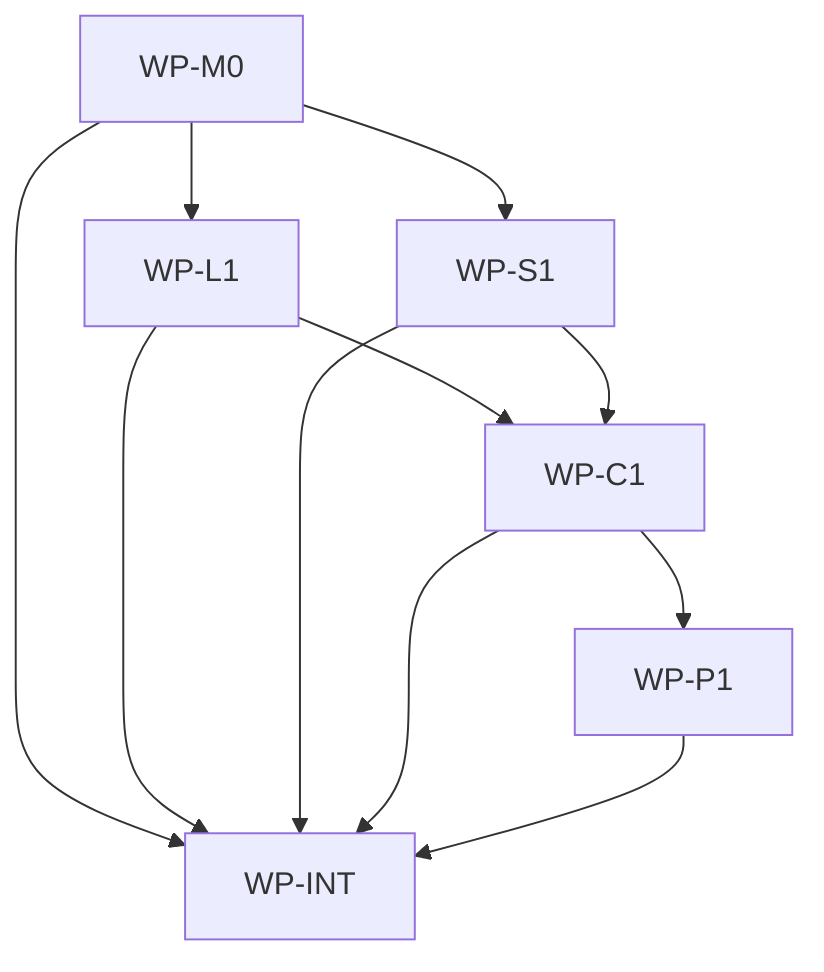

# Map Whitelist

## Context

Repo-map generation currently walks the whole repository root and skips only a short hardcoded set
of directories. In real initialized workspaces that means `make ai-map` can index irrelevant
workspace state such as `.venv`, `.claude`, `.cursor`, and other generated or tool-output folders.
The repo map is public agent infrastructure, so noisy map artifacts directly weaken repo-map-first
discovery and make stale checks more expensive and less meaningful.

## Goal

`aidlc map` and `make ai-map` persist a confirmed folder whitelist in `aidlc.lock.json` and generate
or check repo-map artifacts using only those confirmed folders plus root-level regular files.

## Non-goals

- Do not add a hosted index, network service, git integration, or language-specific AST scanner.
- Do not migrate legacy `.aidlc/manifest.json`; the root `aidlc.lock.json` remains authoritative for
  new map whitelist state.
- Do not make `.ai/` store repo-specific map state.
- Do not add an interactive folder picker UI beyond deterministic terminal confirmation.

## Constraints

- This spec owns only files in the nested AIDLC scope at `/Users/shubhangtiwari/git/aidlc/aidlc`.
- All validation and development gates run through Make targets.
- Normal map/query behavior must remain native Go and must not shell out to Make, git, or Bash.
- `aidlc map --check` must be read-only. It may fail with usage guidance when no whitelist exists,
  but it must not prompt or write `aidlc.lock.json`.
- Scanner behavior must be shared by build and check paths so freshness is computed over the same
  include set that generated `docs/map/index.json`.
- Lock writes must preserve existing `aidlc.lock.json` upstream, generated, files, workspace IDE,
  and metadata fields.
- Whitelist entries are normalized slash-relative directory paths under the map root. Absolute
  paths, parent traversal, empty paths, `docs/map`, and known generated/dependency directories are
  invalid.
- No new ADR is required: the change extends the existing target lock and repo-map contracts without
  introducing a new architecture dependency, persistence class, or integration boundary.

## Affected files

- `aidlc/internal/contract/manifest.go`
- `aidlc/internal/sync/manifest_store.go`
- `aidlc/internal/sync/manifest_store_test.go`
- `aidlc/internal/repomap/options.go`
- `aidlc/internal/repomap/model/index.go`
- `aidlc/internal/repomap/scanner.go`
- `aidlc/internal/repomap/scanner_test.go`
- `aidlc/internal/repomap/staleness.go`
- `aidlc/internal/repomap/staleness_test.go`
- `aidlc/internal/commands/map.go`
- `aidlc/internal/commands/map_test.go`
- `aidlc/internal/cli/root.go`
- `aidlc/internal/cli/root_test.go`
- `aidlc/internal/integration/init_update_test.go`
- `.ai/Makefile.inc`
- `.ai/repo-map-protocol.md`
- `docs/blueprints/aidlc.md`
- `docs/blueprints/repomap.md`
- `docs/blueprints/template-payload.md`
- `docs/map/files.jsonl`
- `docs/map/imports.jsonl`
- `docs/map/tests.jsonl`
- `docs/map/blueprints.jsonl`
- `docs/map/docs.jsonl`
- `docs/map/changes.jsonl`
- `docs/map/index.json`

## Work packages

| ID | Title | Domain | Layer | Wave | Depends on | Parallel? |
| --- | --- | --- | --- | --- | --- | --- |
| WP-M0 | Whitelist contracts | software | contracts | 0 | - | alone |
| WP-L1 | Lock persistence helpers | software | application | 1 | WP-M0 | with WP-S1 |
| WP-S1 | Whitelisted scanner and staleness | software | application | 1 | WP-M0 | with WP-L1 |
| WP-C1 | Map command UX | software | application-interface | 2 | WP-L1, WP-S1 | alone |
| WP-P1 | Public Make helper and protocol text | software | contracts | 3 | WP-C1 | alone |
| WP-INT | Integration gates and blueprint sync | software | integration | 4 | all prior WPs | alone |

## Dependency tree



## Parallel execution plan

| Wave | Work packages | Max parallel implementers |
| --- | --- | --- |
| 0 | WP-M0 | 1 |
| 1 | WP-L1, WP-S1 | 2 |
| 2 | WP-C1 | 1 |
| 3 | WP-P1 | 1 |
| 4 | WP-INT | 1 |

## Design details

Persist the whitelist under the existing root lock:

```json
{
  "workspace": {
    "ides": ["codex"],
    "map": {
      "include": [".ai", "aidlc", "docs"]
    }
  }
}
```

`workspace.map.include` is the canonical saved include list. It is sorted, de-duplicated, slash
normalized, and validated as directory paths relative to the map root. Existing `workspace.ides`
normalization remains unchanged.

`aidlc map --dir DIR` resolves its include list in this order:

1. Explicit include flag, intended for automation and first-run CI.
2. Saved `aidlc.lock.json` `workspace.map.include`.
3. Interactive candidate detection and confirmation.
4. Deterministic usage failure with guidance when no saved or explicit include list exists and the
   process is non-interactive.

The explicit flag should be a compact CLI contract such as `--include DIR[,DIR...]`; repeated flags
are acceptable if the implementation already has a local helper pattern. Supplying an explicit
include list validates and saves that list before generation. `make ai-map` passes the flag only
when `AI_MAP_INCLUDE` is set, so existing saved-whitelist runs stay simple:

```sh
make ai-map
make ai-map AI_MAP_INCLUDE=".ai,aidlc,docs"
make ai-map-check
```

Interactive first-run detection inspects immediate child directories under `--dir`, proposes
candidate folders in stable order, excludes known noise (`.git`, `.venv`, `venv`, `node_modules`,
`vendor`, `.claude`, `.codex`, `.cursor`, `.idea`, `.vscode`, build/dist/cache directories, and
`docs/map`), includes `.ai` when present, and includes likely source/governance folders such as
`aidlc`, `src`, `cmd`, `internal`, `pkg`, `app`, `lib`, `tests`, `test`, and `docs` when present.
The confirmation prompt writes only on an affirmative answer. A negative answer exits with usage
guidance directing the user to rerun with `--include`.

The scanner always considers root-level regular files, then descends only into whitelisted
directories. Existing file extraction, import extraction, doc/spec/ADR/blueprint extraction, shard
writing, SQLite cache building, and query behavior remain unchanged after the candidate file set is
chosen.

`docs/map/index.json` records the include list used for generation. `aidlc map --check` reads the
saved include list, scans with that list, compares file hashes, and also reports stale when the
index include list differs from the saved lock include list. If the lock has no map whitelist,
`--check` exits usage with guidance and does not write.

## Blueprint deltas

- **`docs/blueprints/aidlc.md` § Cross-package Contracts**: Document `aidlc map` first-run
  whitelist confirmation, `--include`, saved whitelist reuse, and read-only `--check` behavior.
- **`docs/blueprints/aidlc.md` § Owned State**: Add `workspace.map.include` to the root
  `aidlc.lock.json` ownership contract and describe map writes preserving existing lock fields.
- **`docs/blueprints/aidlc.md` § Test Gates**: Add coverage requirements for whitelist prompting,
  explicit include automation, lock persistence, and whitelist-aware stale checks.
- **`docs/blueprints/repomap.md` § Cross-package Contracts**: Document scanner options, index
  include metadata, and shared build/check include semantics.
- **`docs/blueprints/repomap.md` § Owned State**: Clarify that generated `docs/map/index.json`
  records the include list and that committed shards reflect the saved whitelist.
- **`docs/blueprints/repomap.md` § Integration Boundaries**: Replace whole-root walk wording with
  whitelisted descent plus root-level regular files.
- **`docs/blueprints/repomap.md` § Test Gates**: Add scanner and staleness coverage for excluded
  tool folders and saved whitelist mismatch.
- **`docs/blueprints/template-payload.md` § Public Payload Contract**: Document `.ai/Makefile.inc`
  map helper variables for explicit first-run automation.
- **`docs/blueprints/template-payload.md` § Update Semantics**: Clarify that payload update may
  refresh public repo-map whitelist guidance without overwriting consumer lock choices.
- **`docs/blueprints/template-payload.md` § Test Gates**: Add validation that public guidance and
  helper changes remain in the manifest payload.

## Test plan

- `aidlc/internal/sync/manifest_store_test.go` - read/write round trip preserves
  `workspace.map.include`, normalizes ordering, rejects invalid paths, and initializes a missing
  root lock for map-only state without legacy migration.
- `aidlc/internal/repomap/scanner_test.go` - scanner includes whitelisted folders, excludes
  `.venv`, `.claude`, `.cursor`, `.codex`, and `docs/map`, and still records root-level regular
  files.
- `aidlc/internal/repomap/staleness_test.go` - fresh/stale checks use the saved include list and
  report stale when `docs/map/index.json` was generated with a different include list.
- `aidlc/internal/commands/map_test.go` - map command saves an explicit include list, reuses saved
  include state without prompting, asks for interactive confirmation on first run, fails
  non-interactively without saved or explicit include state, and keeps `--check` read-only.
- `aidlc/internal/cli/root_test.go` - root CLI wiring passes stdin-capable map dependencies and
  preserves help/routing behavior.
- `aidlc/internal/integration/init_update_test.go` - target lock map state coexists with init/update
  workspace IDE and payload file state without being removed by normal lock writes.
- `.ai/Makefile.inc` coverage through command tests or governance validation - `AI_MAP_INCLUDE`
  produces the documented explicit include flag, while default `make ai-map` relies on saved or
  interactive CLI behavior.
- Final gates: `make aidlc-test`, `make validate-governance`, and `make test`.

## Open questions

- None.

## Implementation notes

- 2026-06-15: Repo-map-first query for "ai-map repo map generation aidlc.lock.json whitelist folder
  indexing" returned no useful paths, so this plan used targeted conventional reads of known
  command, scanner, manifest, Make helper, architecture, ADR, and blueprint files.
