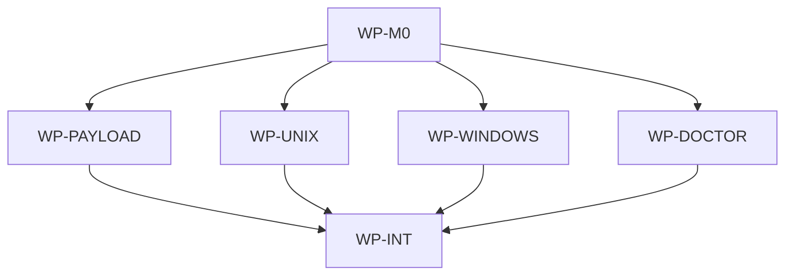

# Install Discovery Robustness

## Context

Local troubleshooting showed a product gap: `aidlc` can be installed correctly but remain
undiscoverable in sanitized shells launched by Codex or IDEs. The current public Make helper relies
on `AIDLC_BIN ?= aidlc`, the Unix installer writes to `/usr/local/bin` by default, and the Windows
installer writes under `$HOME/bin`; none of those surfaces fully explains or compensates for PATH
differences across normal terminals, IDE-launched shells, and CI.

## Goal

When this ships, installed `aidlc` binaries are discoverable through generated tooling, installers
make PATH outcomes explicit, and `aidlc doctor` gives deterministic diagnostics for normal shells,
IDE shells, and CI without requiring personal-machine workarounds.

## Non-goals

- Do not change the release artifact naming scheme or GitHub release repository contract.
- Do not add Homebrew formula changes or claim files under the sibling `homebrew-aidlc` scope.
- Do not edit shell startup files on Unix or silently rely on dotfile mutation.
- Do not make `aidlc init`, `aidlc update`, `aidlc map`, or `aidlc query` depend on Bash, Make,
  git, or a language runtime.
- Do not solve every possible custom install layout; custom paths remain supported through
  `AIDLC_INSTALL_DIR` for installers and `AIDLC_BIN` for Make helpers.

## Constraints

- This spec owns only files in the nested AIDLC scope at `/Users/shubhangtiwari/git/aidlc/aidlc`.
- All validation and implementation gates run through Make targets.
- Public template payload membership remains strictly allowlisted by `.ai/template-manifest.yaml`.
- Generated `.ai/Makefile.inc` must remain a portable Make include suitable for consumer
  repositories and CI.
- Unix installers must not invoke `sudo` internally and must not edit shell dotfiles.
- Windows installer PATH changes must be user-scoped, not machine-scoped, unless the caller has
  explicitly chosen a custom install location.
- CLI diagnostics must be deterministic plain text and must not download assets, rewrite PATH, or
  modify target repository state.
- No new ADR is required: this extends accepted static-binary distribution, native CLI, installer,
  and public payload contracts without adding a new architecture dependency or persistence class.

## Affected files

- `.ai/Makefile.inc`
- `aidlc/internal/contract/options.go`
- `aidlc/internal/install/discovery.go`
- `aidlc/internal/install/discovery_test.go`
- `aidlc/internal/commands/doctor.go`
- `aidlc/internal/commands/doctor_test.go`
- `aidlc/internal/cli/root.go`
- `aidlc/internal/cli/root_test.go`
- `aidlc/internal/integration/makefile_inc_test.go`
- `aidlc/scripts/install.sh`
- `aidlc/scripts/install.ps1`
- `aidlc/scripts/verify-release.sh`
- `aidlc/README.md`
- `docs/blueprints/aidlc.md`
- `docs/blueprints/template-payload.md`

## Work packages

| ID | Title | Domain | Layer | Wave | Depends on | Parallel? |
| --- | --- | --- | --- | --- | --- | --- |
| WP-M0 | Discovery contracts and shared helpers | software | contracts-infrastructure | 0 | - | alone |
| WP-PAYLOAD | Public Make helper resolution | software | contracts | 1 | WP-M0 | with WP-UNIX, WP-WINDOWS |
| WP-UNIX | Unix installer discovery behavior | software | infrastructure | 1 | WP-M0 | with WP-PAYLOAD, WP-WINDOWS |
| WP-WINDOWS | Windows installer user PATH behavior | software | infrastructure | 1 | WP-M0 | with WP-PAYLOAD, WP-UNIX |
| WP-DOCTOR | CLI doctor diagnostics | software | interface-application | 2 | WP-M0 | alone |
| WP-INT | Release checks and blueprint sync | software | integration | 3 | WP-PAYLOAD, WP-UNIX, WP-WINDOWS, WP-DOCTOR | alone |

## Dependency tree

## Parallel execution plan

| Wave | Work packages | Max parallel implementers |
| --- | --- | --- |
| 0 | WP-M0 | 1 |
| 1 | WP-PAYLOAD, WP-UNIX, WP-WINDOWS | 3 |
| 2 | WP-DOCTOR | 1 |
| 3 | WP-INT | 1 |

## Design details

The public Make include should resolve an `aidlc` executable in this order:

1. If `AIDLC_BIN` is set, use it exactly.
2. Otherwise, use `command -v aidlc` when the current shell PATH can find it.
3. Otherwise, try supported common locations:
   - `$HOME/.local/bin/aidlc`
   - `$HOME/bin/aidlc`
   - `/opt/homebrew/bin/aidlc`
   - `/usr/local/bin/aidlc`
   - Windows-compatible executable variants when Make is running in a Windows-like shell.
4. If none is executable, fail before running the requested helper command with guidance that names
   `AIDLC_BIN`, `make ai-doctor`, the Unix installer override, and the PowerShell installer path
   behavior.

`make ai-map`, `make ai-map-check`, and `make ai-query` should all use the same resolver so their
behavior is consistent. Add `make ai-doctor` as a public helper that resolves the binary the same
way and delegates to `aidlc doctor --dir "$(AI_MAP_DIR)"`. If no binary can be resolved,
`make ai-doctor` should print the same actionable resolver failure instead of pretending it can
diagnose through a missing executable.

The Unix installer should retain `AIDLC_INSTALL_DIR` as the highest-priority override. When the
override is absent, it should choose a standard writable destination deterministically:

1. `/usr/local/bin` when it exists or can be created and is writable.
2. `$HOME/.local/bin` as the user-local fallback.
3. A usage failure with guidance when neither destination can be created or written.

After installing, it should check whether the selected directory is on the current PATH. If yes, it
prints the installed path and a simple verification command. If not, it prints a warning and exact
next steps: run with `AIDLC_INSTALL_DIR` pointing to a PATH directory, add the selected directory to
PATH in the caller's shell configuration, or pass `AIDLC_BIN=<installed path>` to Make. The script
must not invoke `sudo` internally and must not edit shell dotfiles.

The Windows installer should default to a user-local application bin directory such as
`$env:LOCALAPPDATA\Programs\aidlc\bin` instead of `$HOME\bin`. It should install `aidlc.exe`, ensure
that directory is present in the user PATH when possible, and print deterministic guidance that a
new terminal or IDE shell may be required for the PATH update to be visible. If the PATH update is
skipped or fails, installation should still report the executable path and the exact manual user
PATH command or `AIDLC_BIN` workaround.

Add `aidlc doctor [--dir DIR]` as a local diagnostic command. The command should report:

- current `aidlc` version and executable path;
- whether `aidlc` is discoverable by PATH in the current process;
- whether known common install locations contain an executable `aidlc`;
- whether the selected repository directory has `.ai/Makefile.inc`;
- whether a root Makefile includes `.ai/Makefile.inc` when a Makefile exists;
- actionable next steps for sanitized shells and CI.

Suggested exit semantics: `0` when no findings need action, `1` when installation or Make helper
discoverability findings are present, and `2` for invalid usage. The command must not mutate PATH,
write files, or perform network access.

## Blueprint deltas

- **`docs/blueprints/aidlc.md` § Cross-package Contracts**: Add `aidlc doctor [--dir DIR]`, its
  diagnostic scope, deterministic output expectations, and exit semantics. Update Make helper
  contract to resolve `aidlc` through `AIDLC_BIN`, PATH, and common install locations.
- **`docs/blueprints/aidlc.md` § Owned State**: Clarify that doctor owns no repository or user
  state, Unix installer owns only the installed executable at the selected destination, and the
  Windows installer may update only the user PATH plus the installed executable in the selected
  user-local bin directory.
- **`docs/blueprints/aidlc.md` § Integration Boundaries**: Update Unix and Windows installer
  boundaries for destination selection, PATH checks, user PATH updates, and no Unix dotfile
  mutation.
- **`docs/blueprints/aidlc.md` § Test Gates**: Add coverage for Make helper fallback resolution,
  installer PATH guidance, Windows user PATH behavior, `aidlc doctor` routing/help/output, and
  packaged-binary doctor smoke checks.
- **`docs/blueprints/template-payload.md` § Public Payload Contract**: Document `.ai/Makefile.inc`
  as the public Make helper that resolves installed `aidlc` robustly and exposes `ai-doctor`.
- **`docs/blueprints/template-payload.md` § Update Semantics**: Clarify that payload updates may
  refresh Make helper discovery logic without modifying consumer repository lock state or local
  Makefile includes.
- **`docs/blueprints/template-payload.md` § Test Gates**: Add validation that Make helper
  discovery behavior remains in the explicit payload and has regression coverage.

## Test plan

- `aidlc/internal/install/discovery_test.go` - common install-location ordering, PATH membership
  checks, explicit override handling, and deterministic no-match guidance using temp directories.
- `aidlc/internal/integration/makefile_inc_test.go` - `make ai-map`, `make ai-query`, and
  `make ai-doctor` use `AIDLC_BIN` when set, find a temp common-location binary when PATH is
  sanitized, and fail with actionable guidance when no candidate exists.
- `aidlc/scripts/install.sh` coverage through release verification or shell-focused tests - default
  writable destination selection, `AIDLC_INSTALL_DIR` override, no internal `sudo`, warning when
  destination is absent from PATH, and no dotfile mutation.
- `aidlc/scripts/install.ps1` coverage through release verification/static checks - default
  user-local app bin path, user PATH update intent, deterministic restart guidance, and preserved
  `AIDLC_INSTALL_DIR` override.
- `aidlc/internal/commands/doctor_test.go` - `aidlc doctor` prints version, executable path, PATH
  status, common candidates, Make helper status, and actionable findings with exit codes `0`, `1`,
  and `2`.
- `aidlc/internal/cli/root_test.go` - root help and routing include `aidlc doctor`.
- `aidlc/scripts/verify-release.sh` - packaged binary exposes `doctor --help`; release check
  assertions reflect the new installer defaults and PATH guidance instead of the old hardcoded
  `/usr/local/bin` requirement.
- Final gates: `make aidlc-test`, `make aidlc-release-check`, `make validate-governance`, and
  `make test`.

## Open questions

- None.

## Implementation notes

- 2026-06-16: Repo-map queries for install/discovery terms returned no useful paths, so planning
  used targeted conventional reads of the scoped governance files, architecture docs, ADRs,
  blueprints, installers, public Make include, CLI routing, upgrade/install implementation, release
  checks, and representative tests.
