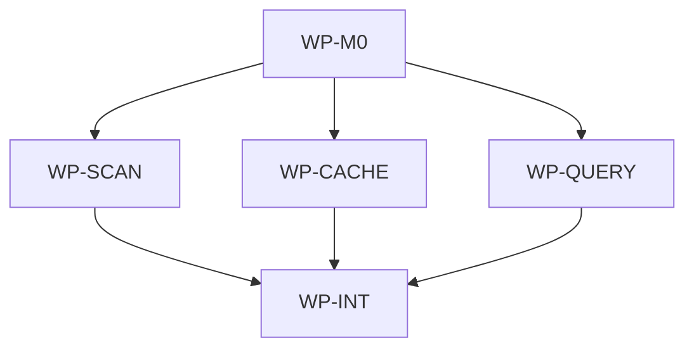

# Improve Repo-Map Lexical Query

## Context

The current repo-map query path is lexical and local, but it underperforms before embeddings because
code files contribute little searchable content beyond paths, languages, imports, tests, and
hashes. SQLite FTS also converts raw query fields into quoted required terms, so natural-language
or question-shaped input can over-constrain results or fail on punctuation and filler words.

## Goal

`aidlc query` should tolerate natural-language search text and return useful ranked paths for code
locations by indexing bounded source-level chunks in the canonical JSONL map and derived SQLite
cache.

## Non-goals

- Introduce embeddings, vectors, remote services, network calls, or a hosted index.
- Replace SQLite FTS5 or the JSONL-canonical / SQLite-derived cache architecture.
- Add symbol-level AST parsing or language-server integration.
- Change the public query output format of `<path>\t<score>\t<snippet>`.
- Make generated source chunks a substitute for reading real source files before editing.

## Constraints

- This spec owns only files in the nested scope root `/Users/shubhangtiwari/git/aidlc/aidlc`.
- Layer rules stay intact: `aidlc/internal/repomap/cache` may import only `model`, standard library,
  and SQLite dependencies; application packages must not import the concrete cache.
- Query processing remains lexical and deterministic. It may normalize terms, drop filler words,
  and loosen matching, but must not add external search dependencies.
- Canonical map state remains JSONL under `docs/map/`; `docs/map/repo-map.sqlite` remains an
  ignored derived cache.
- Source chunks must be bounded and deterministic so generated map diffs stay reviewable.
- Generated `docs/map` artifacts must be regenerated through the CLI path, not manually edited.
- Query improvements must be evaluated with representative question-like queries and the existing
  recall@10 fixture gate.

## Affected files

- `aidlc/internal/repomap/model/index.go`
- `aidlc/internal/repomap/model/record.go`
- `aidlc/internal/repomap/model/record_test.go`
- `aidlc/internal/repomap/model/querytext.go`
- `aidlc/internal/repomap/model/querytext_test.go`
- `aidlc/internal/repomap/scanner.go`
- `aidlc/internal/repomap/scanner_test.go`
- `aidlc/internal/repomap/sourcechunks.go`
- `aidlc/internal/repomap/sourcechunks_test.go`
- `aidlc/internal/repomap/cache/builder.go`
- `aidlc/internal/repomap/cache/builder_test.go`
- `aidlc/internal/repomap/cache/query.go`
- `aidlc/internal/repomap/cache/query_test.go`
- `aidlc/internal/repomap/fallback.go`
- `aidlc/internal/repomap/fallback_test.go`
- `aidlc/internal/cli/root_test.go`
- `aidlc/internal/commands/query_test.go`
- `aidlc/testdata/repomap/integration_queries.go`
- `aidlc/testdata/repomap/fixture-repo/internal/auth/auth.go`
- `aidlc/testdata/repomap/fixture-repo/internal/core/core.go`
- `aidlc/testdata/repomap/fixture-repo/pkg/util/util.go`
- `docs/blueprints/repomap.md`
- `docs/blueprints/aidlc.md`
- `docs/map/blueprints.jsonl`
- `docs/map/changes.jsonl`
- `docs/map/docs.jsonl`
- `docs/map/files.jsonl`
- `docs/map/imports.jsonl`
- `docs/map/index.json`
- `docs/map/source_chunks.jsonl`
- `docs/map/tests.jsonl`

## Work packages

| ID | Title | Domain | Layer | Wave | Depends on | Parallel? |
| --- | --- | --- | --- | --- | --- | --- |
| WP-M0 | Query and source-chunk contracts | software | contracts | 0 | — | alone |
| WP-SCAN | Extract bounded source chunks during map scans | software | application | 1 | WP-M0 | with WP-CACHE, WP-QUERY |
| WP-CACHE | Index source chunks in SQLite cache | software | infrastructure | 1 | WP-M0 | with WP-SCAN, WP-QUERY |
| WP-QUERY | Make lexical query processing natural-language tolerant | software | application-infrastructure | 1 | WP-M0 | with WP-SCAN, WP-CACHE |
| WP-INT | Acceptance queries, generated map artifacts, and blueprint sync | software | integration | 2 | WP-SCAN, WP-CACHE, WP-QUERY | alone |

## Dependency tree

## Parallel execution plan

| Wave | Work packages | Max parallel implementers |
| --- | --- | --- |
| 0 | WP-M0 | 1 |
| 1 | WP-SCAN, WP-CACHE, WP-QUERY | 3 |
| 2 | WP-INT | 1 |

Wave 1 has no overlapping file ownership. WP-M0 freezes the new record/query contracts before
application and infrastructure work begins. WP-INT owns the cross-cutting acceptance tests,
generated map artifacts, and blueprint synchronization after all feature packages land.

## Blueprint deltas

- **`docs/blueprints/repomap.md` § Cross-package Contracts**: document the source-chunk JSONL
  record contract, schema metadata change, and shared lexical query normalization contract.
- **`docs/blueprints/repomap.md` § Owned State**: add `docs/map/source_chunks.jsonl` as canonical
  generated map state and clarify that SQLite derives source rows from JSONL.
- **`docs/blueprints/repomap.md` § Integration Boundaries**: state that source chunking is local,
  bounded, deterministic, and non-vector; keep `modernc.org/sqlite` isolated to cache.
- **`docs/blueprints/repomap.md` § Test Gates**: add natural-language query acceptance and source
  chunk coverage to the existing recall/fallback gates.
- **`docs/blueprints/aidlc.md` § Cross-package Contracts**: update `aidlc query` semantics to
  tolerate question-shaped search terms while preserving output format and exit behavior.
- **`docs/blueprints/aidlc.md` § Owned State**: add the new committed source-chunk shard under
  target `docs/map/`.
- **`docs/blueprints/aidlc.md` § Test Gates**: mention maintained/improved recall@10 and
  representative natural-language query coverage.

No new ADR is required because the existing SQLite repo-map ADR already governs the architecture:
JSONL is canonical, SQLite is derived, and query remains local lexical FTS.

## Test plan

- `make aidlc-test` — model tests cover source-chunk record JSON/sort determinism, schema metadata,
  and query tokenization for punctuation, stopwords, code terms, and empty inputs.
- `make aidlc-test` — scanner tests cover deterministic source chunk extraction, generated map
  exclusion, fixture source coverage, and stable JSONL shard writing.
- `make aidlc-test` — cache builder tests prove source chunks become FTS rows and missing
  `source_chunks.jsonl` remains compatible with older maps.
- `make aidlc-test` — cache query tests cover question-like FTS input such as
  `where is token validation handled?` and punctuation-heavy inputs without requiring every filler
  word to match.
- `make aidlc-test` — fallback tests cover the same tokenization semantics and preserve sorted
  superset behavior.
- `make aidlc-test` — command/root tests exercise representative public CLI queries before/after
  categories, including code-oriented questions and documentation questions.
- `make aidlc-test` — integration acceptance keeps or improves mean recall@10 across at least the
  existing labeled fixture set and any added natural-language labels, with threshold still >= 0.70.
- `make test` — aggregate governance and CLI gates after blueprint and generated map updates.

## Open questions

- None.

## Implementation notes

- Repo-map-first exploration note, 2026-06-18: `make ai-query AI_QUERY="repo-map query lexical
  natural language source chunks repomap cache scanner model"` only echoed the underlying
  `aidlc query` command and returned no actionable path hints, so planning fell back to direct reads
  of the scoped governance docs, blueprints, ADRs, and identified repo-map source files.
