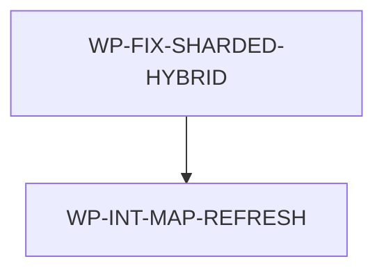

# Code-Aware Repo-Map Retrieval

## Context

Repo-map search already has deterministic local ingredients: JSONL shards, source chunks, imports,
test links, docs/spec/ADR/blueprint records, JSONL fallback, and a pure-Go SQLite FTS5 cache. The
final direction removes vectors entirely. The calling LLM should generate a structured search plan,
and AIDLC should execute that plan through deterministic code-aware lexical retrieval, rank fusion,
relationship expansion, and compact snippets.

## Goal

`aidlc query` accepts raw text or a public structured search plan and returns better ranked,
smaller, code-aware repository navigation results without embeddings, vector tables, model
runtimes, API calls, network services, or new runtime dependencies.

## Material change: final reviewer blockers

A final reviewer pass found two remaining material blockers after shard-filter remediation.

First, cache-backed hybrid structured plans now filter cache results only by shard path membership.
That is still weaker than the public `SearchPlanV1` contract because fallback channels also enforce
`languages` and `include_tests`. Cache FTS hits that fallback would exclude must not leak into
fused final results.

Second, the generated repo map is stale after the shard-filter code/spec changes. `make
ai-map-check` reports stale `aidlc/internal/commands/query.go`,
`aidlc/internal/commands/query_test.go`, and this spec, and `docs/map/index.json` does not include
metadata for `symbols.jsonl` even though the shard exists.

This amendment resets the spec to `status: draft` and authorizes only two follow-up work areas
after explicit approval: the command-layer implementation/regression fix, then a deterministic
`make ai-map` refresh of canonical generated map artifacts followed by freshness and release gates.
ADR files and blueprints remain preserved unless a later implementation discovery proves a material
contract mismatch. Generated files under `docs/map` must be produced by the map command, not edited
by hand.

## Non-goals

- Do not add embeddings, vectors, vector tables, model runtimes, local embedding servers, hosted
  APIs, API keys, cloud transfer, or network services.
- Do not let the model directly scan the repository tree. The model may plan retrieval, but AIDLC
  executes deterministic local retrieval and the model reads real files afterward.
- Do not replace canonical JSONL shards with SQLite as source of truth.
- Do not add AST parsers, language servers, tree-sitter, ripgrep subprocesses, or external search
  engine dependencies.
- Do not break simple raw-text `aidlc query <terms>` usage or the existing tab-separated result
  output shape.
- Do not optimize for perfect semantic synonym matching; this design relies on the calling LLM's
  planned terms plus code-aware identifier and relationship expansion.
- Do not reopen recursive glob semantics, ADR status, query-plan documentation, or blueprints for
  this amendment.
- Do not hand edit generated repo-map artifacts; any `docs/map` changes must come from
  deterministic `make ai-map` output.

## Constraints

- This spec owns only files in the nested scope root `/Users/shubhangtiwari/git/aidlc/aidlc`.
- ADR-1781478129 remains binding: `modernc.org/sqlite` stays isolated to
  `aidlc/internal/repomap/cache`, and release builds must remain pure Go and CGO-disabled across
  Darwin, Linux, and Windows on amd64 and arm64.
- `go.mod` and `go.sum` must not gain vector, model-runtime, network-client, parser, or search
  engine dependencies for this change.
- No network, parser, subprocess, vector, model-runtime, or dependency changes are allowed.
- Do not edit docs, ADRs, blueprints, query-engine internals, cache package contracts, fallback
  matching, model contracts, or test fixtures unless implementation proves a command-layer-only fix
  is impossible.
- Generated repo-map artifacts may change only through `make ai-map`; no manual edits are allowed
  under `docs/map`.
- Public `SearchPlanV1` input must validate all paths and globs as slash-relative, reject absolute
  paths and parent traversal, clamp limits to a documented maximum, and preserve deterministic
  ordering.
- Query output remains navigation evidence, not authority. Agents must read the real source, tests,
  specs, ADRs, and blueprints before making architectural or code claims.

## Affected files

- `aidlc/internal/commands/query.go`
- `aidlc/internal/commands/query_test.go`
- `docs/map/blueprints.jsonl`
- `docs/map/changes.jsonl`
- `docs/map/docs.jsonl`
- `docs/map/files.jsonl`
- `docs/map/imports.jsonl`
- `docs/map/index.json`
- `docs/map/source_chunks.jsonl`
- `docs/map/symbols.jsonl`
- `docs/map/tests.jsonl`

`docs/map/repo-map.sqlite` may be rebuilt by `make ai-map` as a derived ignored local cache, but it
is not a committed canonical map artifact and must not be hand edited.

## Search plan contract

The structured plan should be an explicit public JSON contract, not an internal-only flag. The
calling LLM is the planner, so the boundary must be stable, documented, and testable. Simple raw
text CLI use remains compatible by compiling raw arguments into this contract internally.

`SearchPlanV1` fields:

- `version`: required integer, currently `1`.
- `question`: optional natural-language question for snippets and diagnostics.
- `terms`: lexical terms after caller-side planning.
- `phrases`: exact or near-exact phrases for FTS phrase matching and snippet scoring.
- `symbols`: declaration or identifier candidates such as `Authorize`, `NormalizePrincipal`, or
  `QueryEngine.Query`.
- `paths`: slash-relative path hints or exact paths.
- `globs`: slash-relative file globs such as `aidlc/internal/repomap/**/*.go`.
- `languages`: optional language filters using existing map language labels.
- `shards`: optional shard filters from the known map shard names.
- `include_tests`: optional boolean; default true for raw text and false only when explicitly set.
- `relationship_depth`: optional integer, default `1`, maximum `2`, covering imports and test links.
- `limit`: optional integer, default `10`, maximum `50`.

CLI surface:

- `aidlc query <raw text>`: existing behavior; raw text compiles into `SearchPlanV1`.
- `aidlc query --plan-json JSON`: execute inline plan JSON.
- `aidlc query --plan-file PATH`: execute plan JSON from a local file.
- `--shard NAME` remains valid for raw text and is translated into `shards` for the internal plan.
- Supplying both raw text and `--plan-json` or `--plan-file` is invalid usage.

## Retrieval behavior

AIDLC executes a plan through deterministic local channels:

- SQLite FTS over docs, specs, ADRs, blueprints, files, imports, tests, source chunks, and symbols.
- JSONL fallback scan when the SQLite cache is absent or unusable.
- Hybrid plan execution when the SQLite cache is present: execute FTS text channels through the
  cache-backed querier and execute deterministic path, recursive glob, symbol, source chunk,
  import, and test-link channels through the JSONL fallback querier, then fuse the bounded lists.
- Path/name search over exact paths, path segments, basenames, extensions, and globs.
- Identifier expansion using existing code-term splitting, case folding, plural/singular variants,
  and punctuation normalization.
- Symbol/declaration hits from `symbols.jsonl`, including path, language, kind, name, receiver or
  container when available, and bounded line range.
- Relationship expansion from import records and test records, including implementation-to-test and
  test-to-implementation hops.
- Compact snippet extraction from source chunks, symbol line ranges, docs, and change records.
- Recursive glob semantics: `**` matches zero or more complete path segments, so
  `aidlc/internal/repomap/**/*.go` matches `aidlc/internal/repomap/fallback.go` and
  `aidlc/internal/repomap/cache/query.go`, but does not match `aidlc/internal/commands/query.go`.

Rank fusion:

- Each retrieval channel produces a bounded ranked list.
- Weighted reciprocal-rank fusion combines FTS, phrase, symbol, path, glob, and relationship
  channels.
- Exact path and exact symbol matches receive deterministic boosts.
- Relationship expansion can add related files but must not outrank direct exact matches.
- Final results are de-duplicated by path, sorted by fused score descending and path ascending as a
  deterministic tie-break.

Snippet behavior:

- Default output remains `<path>\t<score>\t<snippet>`.
- Snippets are one-line, whitespace-normalized, and bounded.
- Prefer declaration/source snippets with line ranges for code hits.
- Limit snippets to enough context for navigation, not implementation; target no more than two
  compact snippets per path and no more than 240 visible characters per snippet in default text
  output.

## Work packages

| ID | Title | Domain | Layer | Wave | Depends on | Parallel? |
| --- | --- | --- | --- | --- | --- | --- |
| WP-FIX-SHARDED-HYBRID | Shard-filtered hybrid structured-plan filtering | software | application | 0 | - | alone |
| WP-INT-MAP-REFRESH | Deterministic repo-map refresh and freshness gate | software | application | 1 | WP-FIX-SHARDED-HYBRID | alone |

## Dependency tree

## Parallel execution plan

| Wave | Work packages | Max parallel implementers |
| --- | --- | --- |
| 0 | WP-FIX-SHARDED-HYBRID | 1 |
| 1 | WP-INT-MAP-REFRESH | 1 |

Wave 0 owns the command-layer production fix and targeted command test coverage. Wave 1 owns the
deterministic map refresh after the implementation files are stable. There is no parallel file
ownership and no documentation, ADR, blueprint, cache-package, model-contract, or
fallback/query-engine work package for this amendment.

## Blueprint deltas

None. Existing blueprints already state that cache-backed structured-plan execution is hybrid
SQLite FTS plus deterministic JSONL path, glob, symbol, source chunk, import, and test-link
channels. This amendment fixes implementation conformance to that documented contract and does not
change module contracts, owned state, graph topology, workflow topology, or integration boundaries.

## Test plan

- `make aidlc-test` - add or update a command-level regression in
  `aidlc/internal/commands/query_test.go` that builds a valid `docs/map/repo-map.sqlite` cache,
  removes or alters the JSONL text record needed for one result so that the result can only come
  from cache FTS, and executes `aidlc query --plan-json` with `shards` populated.
- `make aidlc-test` - add or update command-level regression coverage proving cache-backed FTS
  results obey public `SearchPlanV1` `languages` filtering. A cache hit whose language is outside
  the requested language set must be absent from final fused output when the equivalent JSONL
  fallback plan excludes it.
- `make aidlc-test` - add or update command-level regression coverage proving cache-backed FTS
  results obey public `SearchPlanV1` `include_tests: false`. Cache hits from test files must be
  absent from final fused output when fallback would exclude tests.
- `make aidlc-test` - the same regression must prove both channels participate: at least one result
  comes from cache-backed FTS text retrieval and at least one result comes from JSONL fallback plan
  channels such as an exact path, glob, symbol, import, source chunk, or test-link channel.
- `make aidlc-test` - the regression must prove shard filtering is preserved together with language
  and include-test filters: cache FTS results outside the requested shard set must not appear, and
  fallback channel results must come only from records allowed by the plan.
- `make aidlc-test` - the regression must assert deterministic output ordering/de-duplication for
  the fused results, including the existing direct path or symbol precedence where applicable.
- `make aidlc-test` - existing unsharded hybrid retrieval, recursive glob matching, raw-text query,
  plan validation, malformed input, symbol/source chunk indexing, relationship expansion, compact
  snippet, map freshness, ADR/documentation, and integration recall tests remain green without
  modification.
- `make ai-map` - after code/test/spec changes are complete, regenerate canonical map artifacts
  deterministically instead of editing `docs/map` by hand.
- `make ai-map-check` - verify the regenerated map is fresh and `docs/map/index.json` includes
  metadata for `symbols.jsonl`.
- `make aidlc-release-check` - verify the release packaging constraints remain compatible with the
  command-layer implementation.
- `make test` - run the aggregate repository gate after the implementation and map refresh.

## Open questions

- None.

## Implementation notes

- 2026-07-15: Earlier draft directions considered hosted embeddings, local embedding runtimes, and
  vector search. The final user direction removes vector search entirely. This replacement spec
  keeps the same epoch, replaces the ADR, and changes the machine plan to code-aware lexical hybrid
  retrieval.
- 2026-07-15: Repo-map-first exploration used `make ai-query` for structured query plan, symbol,
  declaration, imports, tests, lexical ranking, and snippet terms. The query identified the
  existing lexical repo-map spec and blueprints; direct reads verified the current SQLite FTS,
  source chunk, fallback, CLI, and integration fixture structure before planning this replacement.
- 2026-07-16: Mandatory reviewer found material gaps after implementation: cache-backed
  `QueryPlan` used JSONL fallback only, recursive `**` globs were accepted/documented without true
  recursive matching, and ADR-1784130102 remained `Proposed`. That earlier amendment reset the spec
  to `draft`, narrowed active implementation to those remediation items, and required explicit
  approval before code/test/docs changes or ADR status advancement.
- 2026-07-16: Follow-up reviewer pass found the remediation code and functional gates correct but
  blocked completion on stale generated map artifacts. That earlier amendment kept implementation
  code unchanged, expanded WP-FIX-INT generated-file ownership to all canonical map shards touched
  by a deterministic `make ai-map` refresh, and added an explicit `make ai-map-check` freshness
  gate.
- 2026-07-16: Prior final reviewer pass found one remaining material issue: shard-filtered
  structured plans still skipped SQLite FTS in `cacheFallbackQuerier.QueryPlan` when
  `normalized.Shards` was non-empty. That amendment reset the spec to `draft`, limited active file
  ownership to `aidlc/internal/commands/query.go` and `aidlc/internal/commands/query_test.go`, and
  required targeted regression coverage proving shard-filtered structured plans use both cache FTS
  and JSONL fallback channels while preserving shard filtering and deterministic ordering.
- 2026-07-16: Final review blocker amendment after shard-filter remediation: cache-backed hybrid
  plans must filter cache FTS results by the full public structured-plan filter set, not only shard
  path membership. This means `languages` and `include_tests` exclusions must match fallback
  behavior before cache and fallback results are fused. The same amendment authorizes a deterministic
  `make ai-map` refresh of canonical `docs/map` artifacts because `make ai-map-check` is stale for
  `query.go`, `query_test.go`, and this spec, and `index.json` lacks `symbols.jsonl` metadata.
