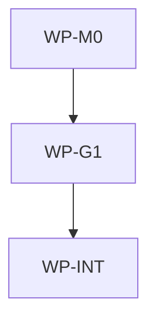

# Refresh persona model defaults and effort

## Context

The public `.ai/models.defaults.toml` payload still selects earlier Codex and Claude models, and the
native generator cannot currently emit Claude Code's supported per-subagent `effort` frontmatter.
Current provider and IDE guidance supports stronger role-specific defaults while retaining Cursor's
existing native `composer-2.5` selection, so generated architect, implementer, and reviewer agents
need a coordinated source, renderer, test, tracked generation-record, and blueprint update. The
role split favors long-horizon reasoning for architecture, coding specialization for
implementation, and complex agentic analysis for review instead of assigning one model family
uniformly.

## Goal

Generated persona agents select the current strong model and effort default appropriate to each
role and IDE, including Claude Code per-subagent effort, while preserving sparse configuration and
IDE-specific output contracts.

## Non-goals

- Discovering available models dynamically from provider or IDE APIs.
- Adding provider-model validation, fallback aliases, or migration compatibility fields.
- Emitting an effort field for Cursor, Copilot, or Windsurf.
- Changing persona instructions, sandbox policy, delegation behavior, or supported IDE identifiers.
- Adding explorer, triage, mechanical-change, security-specialist, or other new personas.
- Selecting GPT-5.6 Terra for the current architect, implementer, or reviewer personas; the
  implementation tier deliberately uses Luna with `xhigh` effort instead.
- Selecting Claude Mythos 5; it is invitation-only and intended for defensive cybersecurity through
  Project Glasswing, so it is not a portable general persona default.
- Introducing `max` effort for routine governed work.

## Constraints

- This spec owns only paths under the resolved AIDLC scope rooted at this repository.
- Root `.ai/` model defaults remain data consumed by the application-layer generator; they must not
  introduce runtime network access or provider SDK dependencies.
- Use the exact mappings: Codex architect `gpt-5.6-sol` with `xhigh`, Codex implementer
  `gpt-5.6-luna` with `xhigh`, Codex reviewer `gpt-5.6-sol` with `xhigh`; Claude architect
  `claude-fable-5` with `xhigh`, Claude implementer `claude-sonnet-5` with `high`, Claude reviewer
  `claude-opus-4-8` with `xhigh`; Cursor all roles `composer-2.5` with no effort field.
- Preserve `reasoning` as the source key for Codex `model_reasoning_effort`; add a distinct
  `effort` source key for Claude Code frontmatter rather than overloading one provider's field.
- Empty or absent `model`, `reasoning`, and `effort` values continue to omit the corresponding
  generated field.
- Execute generation and verification through root Makefile targets only.
- `make init all` is the authoritative regeneration path; the implementation must reject any
  unexpected tracked source diff.
- `.claude/**`, `.codex/**`, and `.cursor/**` are ignored, untracked validation projections in this
  source repository. `make init all` may write them, and their content must be inspected for the
  expected model and effort fields, but they are not committed deliverables or allowed tracked
  edits under this spec.
- `aidlc.lock.json` is a tracked, authoritative generation record and must contain the complete
  canonical output from the final successful `make init all` run. Accept the generated timestamp,
  normalized field ordering, `metadata.command: init`, `metadata.source_url`, the changed
  `.ai/models.defaults.toml` checksum, and reconciliation of stale `.ai/Makefile.inc` and
  `.ai/repo-map-protocol.md` checksums to their current tracked bytes. Do not hand-narrow this lock
  diff; the two helper checksum changes do not authorize edits to those helper source files.
- Existing untracked repo-map ADR/spec drafts are outside this spec and must remain untouched.
- No ADR is required because the change extends the existing data-driven native generation
  contract without changing layers, integration boundaries, or workflow topology.

## Selection rationale

- `gpt-5.6-sol` is the quality-first Codex family choice for architecture and review, where deep
  reasoning and careful contract analysis matter more than throughput; both roles use `xhigh`.
- `gpt-5.6-luna` is deliberately selected as the efficient Codex implementation tier and paired
  with `xhigh` reasoning to preserve a strong governed coding quality bar. `gpt-5.6-terra` is not
  selected by the current architect, implementer, or reviewer personas.
- `claude-fable-5` is the highest-capability long-horizon Claude option and is reserved for
  architecture. Its higher cost and possible benign coding/debugging refusals make it a poor
  uniform default across implementation and review.
- `claude-sonnet-5` remains the daily coding choice for implementation, while
  `claude-opus-4-8` remains suitable for complex agentic code review.
- `composer-2.5` remains the newest native Cursor choice and avoids the current organization-level
  cost multiplier for other Cursor models.

## Affected files

- `.ai/models.defaults.toml`
- `aidlc/internal/generator/models.go`
- `aidlc/internal/generator/templates.go`
- `aidlc/internal/generator/render.go`
- `aidlc/internal/generator/generator_test.go`
- `aidlc.lock.json`
- `docs/blueprints/aidlc.md`
- `docs/blueprints/template-payload.md`

Validation-only projections written by `make init all`, intentionally ignored and untracked:

- `.claude/agents/{architect,implementer,reviewer}.md`
- `.codex/agents/{architect,implementer,reviewer}.toml`
- `.cursor/agents/{architect,implementer,reviewer}.md`

## Work packages

| ID | Title | Domain | Layer | Wave | Depends on | Parallel? |
| --- | --- | --- | --- | --- | --- | --- |
| WP-M0 | Persona model-default contract | software | application | 0 | — | alone |
| WP-G1 | Native rendering and unit coverage | software | application | 1 | WP-M0 | alone |
| WP-INT | Projection validation, lock, and blueprint synchronization | software | integration | 2 | WP-G1 | alone |

## Dependency tree

## Parallel execution plan

| Wave | Work packages | Max parallel implementers |
| --- | --- | --- |
| 0 | WP-M0 | 1 |
| 1 | WP-G1 | 1 |
| 2 | WP-INT | 1 |

The waves are intentionally serial because renderer and generated-artifact work consumes the
contract established in WP-M0, and no active wave has overlapping file ownership.

## Blueprint deltas

- **`docs/blueprints/template-payload.md` § Public Payload Contract / Test Gates**: document that
  `.ai/models.defaults.toml` supplies per-IDE, per-persona model defaults; Codex may carry
  `reasoning`, Claude may carry `effort`, Cursor carries only `model`, and absent optional fields
  are omitted. Require coverage of the published role mapping.
- **`docs/blueprints/aidlc.md` § Cross-package Contracts / Test Gates**: document native rendering
  of Codex `model_reasoning_effort` and Claude Code `effort` from the defaults contract, retention
  of model-only Cursor frontmatter, and tests for exact role mappings and omission behavior.

## Test plan

- `aidlc/internal/generator/generator_test.go` — generate all IDE surfaces from a fixture containing
  the complete role matrix and assert the exact Codex model/reasoning, Claude model/effort, and
  Cursor model-only frontmatter for architect, implementer, and reviewer.
- `aidlc/internal/generator/generator_test.go` — verify an absent or empty Claude effort does not
  emit `effort:` and existing sparse defaults continue to generate successfully.
- `make init all` — regenerate ignored IDE projections and verify their exact role mappings:
  Claude emits `model` plus `effort`, Codex emits `model` plus `model_reasoning_effort`, and Cursor
  remains `composer-2.5` with no effort field.
- `make init all` — refresh tracked `aidlc.lock.json` and retain its complete canonical result,
  including generation/command/source metadata, the model-default checksum, and reconciled helper
  checksums; verify no generated persona path becomes tracked.
- `make aidlc-test` — run isolated Go module coverage after contract and renderer changes.
- `make test` — run aggregate generator and governance validation after artifact and blueprint sync.

## Open questions

- None.

## Implementation notes

- 2026-07-15 — WP-INT discovery: `make init all` writes `.claude/**`, `.codex/**`, and `.cursor/**`
  as ignored, untracked projections rather than checked-in deliverables. The command also rewrites
  tracked `aidlc.lock.json` as the authoritative init record, refreshing generation metadata and
  payload checksums, including stale checksums for unchanged `.ai/Makefile.inc` and
  `.ai/repo-map-protocol.md`. The spec returned from `approved` to `draft` so tracked artifact
  ownership and the full accepted lock output can be reapproved before WP-INT resumes.
- 2026-07-15 — Mandatory reviewer P2: sparse generation coverage exercised explicit-empty optional
  fields but did not exercise truly absent `model` and Codex `reasoning` keys. WP-G1 was reopened
  for test-only omission assertions; no production logic, model mapping, blueprint delta, or other
  implementation-plan change is required.
