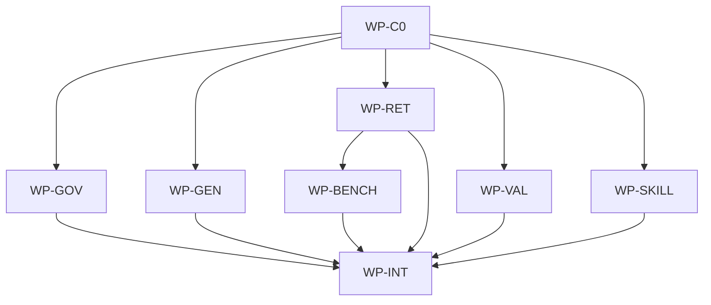

# Token-Efficient Harness Redesign

## Context

The honest harness audit found that AIDLC's current governance model preserves important ownership,
contract, and distribution guarantees but pays too much prompt and process overhead. Current
evidence includes `generateCodex` embedding full persona and skill bodies into root `AGENTS.md`,
`generateCursor` also writing root `AGENTS.md` after Codex in `all` generation order, architect
Codex agents rendered read-only despite needing to save specs, fixed high reasoning defaults in
`.ai/models.defaults.toml`, raw query fallback that only handles cache errors rather than empty
cache misses, alphabetical raw JSONL fallback ranking, and fixed early source chunk caps.

## Goal

AIDLC ships a smaller, evidence-based harness that keeps portable ownership and high-risk gates
while making normal low-risk work, source discovery, validation, and review cheaper and more honest.

## Non-goals

- Refreshing the user's outer installed or Homebrew guidance in this change.
- Removing supported Codex, Cursor, Claude, Copilot, or Windsurf projections.
- Replacing the repo map with `rg`, embeddings, vectors, hosted search, or model runtimes.
- Claiming tokenizer-accurate measurements or real LLM cost savings without host-reported data.
- Proving human approval, model review, or host write isolation through the local CLI.
- Adding broad runtime/platform hooks beyond the minimal CLI, Make, and CI validation described here.

## Constraints

- This spec owns only the nested product scope at `/Users/shubhangtiwari/git/aidlc/aidlc`.
- Execute through real Make targets only: `make validate-governance`, `make aidlc-test`,
  `make aidlc-release-check`, and `make test`.
- Keep normal init/update native and cross-platform; do not reintroduce Bash init/update behavior.
- Keep public payload membership allowlisted through `.ai/template-manifest.yaml`.
- Keep JSONL map shards canonical and SQLite derived; optional exact search must not become required
  target repository state.
- Maintain backward compatibility for existing raw `aidlc query`, `--plan-json`, `--plan-file`,
  `aidlc init`, `aidlc update`, and generated IDE surfaces.
- One writer per path per active wave; overlapping files wait for WP-INT.

## Affected files

- `docs/adr/1790867975-token-efficient-harness.md`
- `docs/spec/README.md`
- `docs/repomap-query-plan.md`
- `.ai/README.md`
- `.ai/repo-map-protocol.md`
- `.ai/models.defaults.toml`
- `.ai/template-manifest.yaml`
- `.ai/personas/architect.md`
- `.ai/personas/implementer.md`
- `.ai/personas/reviewer.md`
- `.ai/skills/classify-change.md`
- `.ai/skills/orchestrate-spec.md`
- `.ai/templates/spec.md`
- `.ai/templates/task-record.md`
- `aidlc/internal/contract/manifest.go`
- `aidlc/internal/contract/manifest_test.go`
- `aidlc/internal/contract/task_record.go`
- `aidlc/internal/contract/task_record_test.go`
- `aidlc/internal/contract/benchmark_record.go`
- `aidlc/internal/contract/benchmark_record_test.go`
- `aidlc/internal/contract/installed_skill.go`
- `aidlc/internal/contract/installed_skill_test.go`
- `aidlc/internal/generator/generator.go`
- `aidlc/internal/generator/render.go`
- `aidlc/internal/generator/templates.go`
- `aidlc/internal/generator/models.go`
- `aidlc/internal/generator/ide.go`
- `aidlc/internal/generator/generator_test.go`
- `aidlc/internal/integration/init_update_test.go`
- `aidlc/internal/integration/windows_paths_test.go`
- `aidlc/internal/commands/query.go`
- `aidlc/internal/commands/query_test.go`
- `aidlc/internal/commands/validate.go`
- `aidlc/internal/commands/validate_test.go`
- `aidlc/internal/commands/benchmark.go`
- `aidlc/internal/commands/benchmark_test.go`
- `aidlc/internal/commands/doctor.go`
- `aidlc/internal/commands/doctor_test.go`
- `aidlc/internal/commands/skill.go`
- `aidlc/internal/commands/skill_test.go`
- `aidlc/internal/commands/init.go`
- `aidlc/internal/commands/init_test.go`
- `aidlc/internal/commands/update.go`
- `aidlc/internal/commands/update_test.go`
- `aidlc/internal/skills/installed.go`
- `aidlc/internal/skills/installed_test.go`
- `aidlc/internal/sync/manifest_store.go`
- `aidlc/internal/sync/manifest_store_test.go`
- `aidlc/internal/sync/planner.go`
- `aidlc/internal/sync/planner_test.go`
- `aidlc/internal/payload/paths.go`
- `aidlc/internal/payload/paths_test.go`
- `aidlc/internal/search/exact.go`
- `aidlc/internal/search/exact_test.go`
- `aidlc/internal/repomap/model/exact_search.go`
- `aidlc/internal/repomap/model/exact_search_test.go`
- `aidlc/internal/repomap/model/queryplan.go`
- `aidlc/internal/repomap/model/queryplan_test.go`
- `aidlc/internal/repomap/fallback.go`
- `aidlc/internal/repomap/fallback_test.go`
- `aidlc/internal/repomap/retrieval.go`
- `aidlc/internal/repomap/retrieval_test.go`
- `aidlc/internal/repomap/sourcechunks.go`
- `aidlc/internal/repomap/sourcechunks_test.go`
- `aidlc/internal/repomap/cache/query.go`
- `aidlc/internal/repomap/cache/query_test.go`
- `aidlc/testdata/repomap/integration_queries.go`
- `aidlc/testdata/repomap/unknown_location_queries.go`
- `aidlc/internal/cli/root.go`
- `aidlc/internal/cli/root_test.go`
- `aidlc/internal/cli/retrieval_benchmark_test.go`
- `aidlc/README.md`
- `README.md`
- `Makefile`
- `.ai/Makefile.inc`
- `aidlc/internal/integration/makefile_inc_test.go`
- `.github/workflows/aidlc-ci.yml`
- `docs/architecture/software.md`
- `docs/blueprints/aidlc.md`
- `docs/blueprints/template-payload.md`
- `docs/blueprints/repomap.md`

## Work packages

| ID | Title | Domain | Layer | Wave | Depends on | Parallel? |
| --- | --- | --- | --- | --- | --- | --- |
| WP-C0 | Contracts, ADR, and schema baselines | software | contracts | 0 | - | alone |
| WP-GOV | Portable governance and lazy guidance | software | payload | 1 | WP-C0 | with WP-GEN, WP-RET, WP-VAL |
| WP-GEN | Compact IDE generation and root entrypoint collision handling | software | application | 1 | WP-C0 | with WP-GOV, WP-RET, WP-VAL |
| WP-RET | Adaptive exact/path retrieval and fallback ranking | software | application | 1 | WP-C0 | with WP-GOV, WP-GEN, WP-VAL |
| WP-VAL | Minimal executable workflow validation and task records | software | application | 1 | WP-C0 | with WP-GOV, WP-GEN, WP-RET |
| WP-SKILL | Installed local skill lifecycle and preservation | software | application | 1 | WP-C0 | queued with WP-GOV, WP-GEN, WP-RET, WP-VAL |
| WP-BENCH | Retrieval and context-budget benchmark evidence | software | test-support | 2 | WP-RET | alone |
| WP-INT | Wiring, CI, docs, and blueprint sync | software | integration | 3 | WP-GOV, WP-GEN, WP-RET, WP-VAL, WP-SKILL, WP-BENCH | alone |

## Dependency tree



## Parallel execution plan

| Wave | Work packages | Max parallel implementers |
| --- | --- | --- |
| 0 | WP-C0 | 1 |
| 1 | WP-GOV, WP-GEN, WP-RET, WP-VAL, WP-SKILL | 3 |
| 2 | WP-BENCH | 1 |
| 3 | WP-INT | 1 |

Wave 0 exists because this redesign changes shared contracts: the proposed ADR, task record schema,
benchmark metadata schema, installed-skill lifecycle DTOs, SearchPlanV1 semantics, ExactSearcher
DTOs, and template expectations. There is no forced feature-complete Wave 0 service work. Parallel
wave 1 packages have disjoint file ownership, but the orchestrator runs at most three wave-1
implementers at once because the host has root plus three available worker slots; remaining packages
queue in the same wave.

## Concrete interface decisions

### Generated guidance budgets

The checked-in audit baseline is approximately 2,349 words for root `AGENTS.md` and 5,901 words for
the persona plus skill bodies that can be embedded by current projections. New generated root
entrypoints use honest word and byte proxies only; tests must not claim tokenizer accuracy.

- `AGENTS.md` and `CLAUDE.md` root entrypoints: at most 1,200 words and 9,000 bytes each, excluding
  only the generated comment line.
- Default project facts are included inside that budget up to 150 words and 1,200 bytes.
- Manifest-enriched facts may add at most 100 words and 800 bytes per detected manifest, up to two
  manifests, with an absolute root-entrypoint cap of 1,400 words and 10,500 bytes.
- Native IDE catalog files may point to full bodies, but the root entrypoint must list only compact
  names, descriptions, and paths.
- Final generator tests compare generated output against a fixed old-style full-body fixture and
  require at least a 40 percent reduction in both root-entrypoint words and bytes.

### Governance routing enums

`classify-change` replaces the old `next` set with explicit lower-friction routes:

- `direct-execute`: trivial, reversible, no contract/state/topology/integration impact; the primary
  agent may edit directly after stating intent because the user's request is the authorization.
- `direct-intent`: small low-risk work where an inline intent improves visibility; the primary agent
  may proceed after posting intent unless new evidence changes risk.
- `bounded-investigation`: uncertain work where a short read-only investigation can resolve tier;
  it does not automatically become a full spec.
- `draft-spec`: medium, large, high-risk, or still-uncertain work after investigation.
- `ask-user`: only when a user answer would materially change route or scope.

High-risk approval and independent correctness review stay mandatory for `draft-spec`.

### Validation CLI and task record schema

Add a read-only command:

```sh
aidlc validate [--dir DIR] [--spec PATH] [--task-record PATH] [--base REV] \
  [--changed-file PATH ...] [--high-risk] [--format text|json]
```

Exit codes are `0` for pass, `1` for validation failures, and `2` for usage or unreadable state.
Paths are slash-relative to the selected scope. `--changed-file` may repeat. The command never writes
and never self-authenticates approval or review.

Task records are local evidence files, recommended at `docs/tasks/<task-id>.task.json` and excluded
from public payload copying. Minimal v1 shape:

```json
{
  "schema_version": 1,
  "id": "task-1790867975-token-efficient-harness",
  "spec": "docs/spec/1790867975-token-efficient-harness.md",
  "risk": "high",
  "scope_root": ".",
  "base_revision": "HEAD~1",
  "owned_files": ["aidlc/internal/commands/query.go"],
  "content_digest": "sha256:<dirty-tree-owned-files-digest>",
  "acceptance": ["make aidlc-test passes"],
  "decisions": [{"summary": "Use bounded rg exact search", "sources": ["docs/adr/1790867975-token-efficient-harness.md"], "fresh_at": "2026-10-01"}],
  "checks": [{"command": "make aidlc-test", "status": "passed", "revision": "HEAD", "content_digest": "sha256:<digest>"}],
  "review": {"kind": "independent", "evidence": "reviewer finding summary or URL", "revision": "HEAD", "content_digest": "sha256:<digest>"},
  "open_next_steps": []
}
```

The digest is computed from current dirty-tree contents of `owned_files` including uncommitted
changes, normalized paths, file modes, and missing-file markers; HEAD alone is insufficient.

### Exact search query contract

SearchPlanV1 gains an optional `exact_search` object:

```json
{
  "enabled": true,
  "literals": ["Generate("],
  "paths": ["aidlc/internal/generator"],
  "max_results": 20,
  "max_bytes": 12000,
  "timeout_ms": 750
}
```

Defaults clamp to `max_results: 20`, `max_bytes: 12000`, and `timeout_ms: 750`. Hard maximums are
50 results, 65536 bytes, 2000 ms, eight literals, and sixteen path hints. Literals are fixed-string
matches. Paths are validated slash-relative path prefixes or file paths; absolute paths, parent
traversal, backslashes, colons, empty segments, and shell metacharacter interpretation are rejected.
Raw query may auto-enable exact search only when high-signal path, symbol, or literal clues are
present.

Application query code depends on `repomap/model.ExactSearcher` and DTOs, not on
`aidlc/internal/search`. The CLI composition root wires `internal/search` as the infrastructure
adapter. The adapter invokes `rg` only with `exec.CommandContext(ctx, rgPath, args...)`, never
through a shell; arguments include fixed-string, line/column, no-heading, no-color flags, validated
globs, and the repository root as working directory.

Default TSV stdout remains backward-compatible. `aidlc query --diagnostics` may write omission and
fallback notes to stderr. `aidlc query --format json` may include diagnostics in JSON output.

### Benchmark metadata

Add opt-in retrieval benchmark output, either through stdout or an explicit local file:

```sh
aidlc benchmark retrieval --dir DIR --queries PATH --output docs/tasks/<task-id>.benchmark.json
```

`make ai-benchmark AI_BENCHMARK_ARGS="retrieval --queries ... --output ..."` wraps it. The v1
benchmark record includes schema version, command, revision, dirty-tree content digest, query set,
expected paths, recall@10, precision@10, repeated reads, retries, output bytes, output words, and
optional host-reported input/output tokens or cost. Repeated reads and retries must come from the
scripted benchmark or host activity logs, not from static fixture inference. Unknown-location
queries should omit path hints from the query text while still carrying expected paths in the
benchmark fixture. Acceptance thresholds: at least 10 unknown-location queries, mean recall@10 >=
0.80, no critical expected path missing in more than one query, and compact output bytes at least
30 percent below the source-heavy baseline.

### Make helper contracts

`.ai/Makefile.inc` adds:

- `ai-validate`: resolves `aidlc` like existing map helpers and runs `aidlc validate --dir .`
  plus `AI_VALIDATE_ARGS`.
- `ai-benchmark`: resolves `aidlc` and runs `aidlc benchmark` plus `AI_BENCHMARK_ARGS`.

`aidlc/internal/integration/makefile_inc_test.go` covers both wrappers. Root `Makefile` may call
these helpers from `validate-governance` or CI only after the corresponding CLI commands exist.

### Installed local skill contracts

Add a local skill lifecycle surface:

```sh
aidlc skill install [--dir DIR] LOCAL_DIR
aidlc skill list [--dir DIR] [--format text|json]
aidlc skill remove [--dir DIR] NAME
```

`LOCAL_DIR` must contain `SKILL.md` with YAML frontmatter including `name` and `description`.
`name` must be slash-safe kebab-case and must match the destination folder name unless the future
contract explicitly adds a rename flag. The first release supports local directories only; git
sources are intentionally deferred. Install copies the full validated tree to
`.ai/skills/installed/<name>/` without executing scripts, without following symlinks, and without
allowing absolute paths, parent traversal, hidden VCS metadata, device files, sockets, or files that
escape the source root. It rejects collisions with bundled skill names under `.ai/skills/*.md` and
with existing installed skill names unless the user explicitly removes and reinstalls. Source edits
require explicit reinstall; `aidlc update --force` must not override installed sources.

Installed skills are consumer-owned `.ai` state, so ownership is mixed: bundled `.ai` files remain
payload-owned, while `.ai/skills/installed/**` remains local consumer-owned state. Payload sync must
exclude installed sources even during `update --force`, and must reject or preserve any malicious or
accidental upstream manifest entry targeting `.ai/skills/installed/**`.

During `aidlc init <codex|cursor|claude|all>` and update regeneration, installed skill trees are
copied into native skill folders alongside bundled skills:

- Codex: `.codex/skills/<name>/SKILL.md` plus the full installed tree.
- Cursor: `.cursor/skills/<name>/SKILL.md` plus the full installed tree.
- Claude Code: `.claude/skills/<name>/SKILL.md` plus the full installed tree.
- Copilot and Windsurf: documented as root-guidance-only; no native skill projection is created
  unless those IDEs gain a native skill folder contract later.

Projection ownership and checksums are tracked in the lock file. Independent edits to generated
native skill projections are reported as conflicts on regeneration. `aidlc skill remove NAME`
removes `.ai/skills/installed/<name>/` and deletes only owned unmodified native projections;
diverged projections are preserved and reported.

The lock contract extends `aidlc.lock.json` through `TargetManifest.Generated.Projections`, a
versioned list of generated projection records:

```json
{
  "ide": "codex",
  "source": ".ai/skills/installed/example",
  "path": ".codex/skills/example/SKILL.md",
  "checksum": "sha256:<generated-file-checksum>",
  "mode": "0644"
}
```

`source` and `path` are slash-relative. Checksums are over generated destination bytes. Lock
read/write must preserve this projection list when init/update rebuilds `TargetManifest` from
payload files, just as map include is preserved today. Removing a skill consults these records and
deletes only destination files whose current checksum still matches the owned record.

## Blueprint deltas

- **`docs/blueprints/aidlc.md` § Cross-package Contracts**: add compact generated entrypoint
  behavior, deterministic shared `AGENTS.md`, lazy native persona/skill catalogs, opt-in/inherited
  model defaults, `aidlc validate`, `aidlc skill`, and task record schema contracts.
- **`docs/blueprints/aidlc.md` § Layer Map**: add `aidlc/internal/search` as infrastructure for
  optional bounded local exact search, wired through interfaces from CLI composition; add
  `aidlc/internal/skills` as the application package for installed-skill lifecycle.
- **`docs/blueprints/aidlc.md` § Owned State**: add optional local task record files and installed
  skill sources/projections; clarify that generated task records are not public template payload and
  installed skill sources are consumer-owned local state.
- **`docs/blueprints/aidlc.md` § Integration Boundaries**: allow optional local `rg` subprocess
  discovery only through the bounded search integration, and clarify it is unavailable-safe.
- **`docs/blueprints/aidlc.md` § Test Gates**: replace exact fixed persona default assertions with
  inherited/opt-in behavior; add compact guidance budgets, validation command coverage, review
  evidence coverage, and unknown-location retrieval metrics.
- **`docs/blueprints/template-payload.md` § Public Payload Contract**: describe compact shared root
  entrypoints, native lazy catalogs, task record template membership, installed skill exclusion, and
  opt-in model defaults.
- **`docs/blueprints/template-payload.md` § Update Semantics**: preserve consumer task records and
  installed skills; avoid copying local in-flight/task evidence or installed skill sources as public
  payload.
- **`docs/blueprints/template-payload.md` § Test Gates**: add manifest exclusions and generation
  coverage for compact root guidance and instruction-size proxy budgets.
- **`docs/blueprints/repomap.md` § Package Boundary**: add optional exact/path discovery as an
  augmentation to structural map query, not a replacement.
- **`docs/blueprints/repomap.md` § Cross-package Contracts**: add SearchPlanV1 exact-search hints,
  omission reporting, empty-cache fallback semantics, score-ranked fallback ordering, and
  representative source chunk coverage.
- **`docs/blueprints/repomap.md` § Integration Boundaries**: revise the current search subprocess
  prohibition to permit bounded local `rg` through `aidlc/internal/search` only.
- **`docs/blueprints/repomap.md` § Test Gates**: add unknown-location benchmark fixtures, proxy
  context-size metrics, fallback behavior, and optional host-reported usage fields.

## Test plan

- `make validate-governance` - manifest still excludes numbered specs/ADRs/blueprints and local
  task evidence; new task record template inclusion, if public, is explicit.
- `make aidlc-test` - generator tests assert compact root `AGENTS.md`, external native catalogs,
  deterministic Codex/Cursor collision behavior, architect write permission, reviewer read-only
  permission, and byte/word instruction budgets.
- `make aidlc-test` - governance tests or golden fixtures assert low-risk direct route text,
  bounded investigation for uncertain work, proportional specs, optional parallel WPs, and retained
  high-risk approval/review requirements.
- `make aidlc-test` - query tests assert empty raw cache results can fall back, raw fallback ranks
  by score and path, exact/path search is fused and unavailable-safe, and source chunks include
  later representative code without unbounded output.
- `make aidlc-test` - validation tests assert approved-spec status, scope/file ownership, check
  revision, review evidence references, schema versions, honest negative cases, and no fabricated
  approval/model-review proof.
- `make aidlc-test` - skill lifecycle tests assert full-tree install, SKILL.md validation, unsafe
  path and symlink rejection, bundled/installed collision rejection, local-source preservation
  during normal and forced update, malicious installed-subtree manifest rejection, native projection
  conflict detection, and remove preserving diverged projections.
- `make aidlc-test` - benchmark tests assert unknown-location recall and deterministic proxy metrics
  for bytes, words, repeated reads, retries, and optional host usage fields.
- `make aidlc-release-check` - release remains CGO-disabled and does not introduce required `rg`,
  model, vector, parser, network, or hosted search dependencies.
- `make test` - aggregate gate after WP-INT.

## Acceptance scenarios

- Running `make init all` in a fixture writes one compact root `AGENTS.md`, preserves Codex and
  Cursor native catalogs, and keeps root instruction bytes/words under documented budgets.
- Running `aidlc skill install ./local-skill` copies the full validated tree to
  `.ai/skills/installed/<name>/`, and `make init all` projects it into Codex, Cursor, and Claude
  native skill folders without projecting native folders for Copilot or Windsurf.
- Running `aidlc update --force` does not overwrite `.ai/skills/installed/<name>/`, even if the
  upstream manifest includes that destination by mistake or malice.
- Running `aidlc skill remove <name>` deletes only owned unmodified native projections and reports
  any independently edited projection it preserves.
- Running `make init codex` renders architect with the configured scope-write capability needed to
  save specs, and reviewer with read-only permissions.
- A small reversible governed edit is routed through primary-agent triage and inline intent without
  mandatory delegation or redundant human approval, while a contract/state/topology change still
  requires approved spec and review.
- `aidlc query` on a stale or sparse cache can still return JSONL fallback matches for raw text.
- `aidlc query` with path/symbol/literal clues uses `rg` when available, reports bounded omissions,
  and returns deterministic structural-map results when `rg` is missing.
- `aidlc validate` accepts a valid approved-spec/high-risk task record with evidence at the current
  revision and rejects changed-scope, missing-review, stale-check, and malformed-schema cases.
- CI and Make run only real targets; no lint or tokenizer checks are invented.

## Migration

Existing repositories keep their `.ai/**`, generated IDE files, and `aidlc.lock.json` state.
After updating the payload and running `make init <ide>` or `make init all`, root guidance is
regenerated into the compact format and native persona/skill catalogs remain available. Existing
SearchPlanV1 callers continue to work because new fields are optional and the version remains
compatible unless implementation discovers a breaking need, in which case architect amendment is
required. Existing specs and ADRs remain local artifacts. Existing map JSONL and SQLite files can
be regenerated by `make ai-map`; query continues if `rg` is unavailable.

Task records are introduced as local versioned evidence artifacts. They are not required for tiny
fixes, are not broad public payload, and should be preserved by update. Validation can consume them
when present or required by a high-risk/approved-spec workflow.

Installed skills are introduced as local consumer-owned `.ai` state. Existing repositories are
unchanged until a user runs `aidlc skill install LOCAL_DIR`. Once installed, normal init/update
regeneration includes native projections for supported IDEs. Updating the original local source
directory does not automatically mutate the installed copy; users reinstall explicitly.

## Benchmark evidence limits

Benchmark gates use deterministic proxies that the CLI can measure locally: output bytes, output
words, result counts, expected-path recall, repeated file reads, and retry counts. Host-reported
input/output tokens or cost may be recorded if a host provides them, but they are optional and are
not computed by the CLI. Fixture benchmarks can show regression resistance and relative context
budget changes; they must not claim full end-to-end LLM savings or production cost reductions.

## Review guidance

Reviewer guidance should emphasize correctness failures and recovery paths: approval/spec mismatch,
stale evidence, unsupported changed files, conflicting active writers, changed generated payload
membership, retrieval omissions hidden from the user, unavailable `rg`, source chunk tail loss,
fallback ordering regressions, and invalid claims about tokens or approval proof. Verification
should be targeted to the changed surface and its public contracts rather than broad reruns after
passing gates.

## Open questions

- None.

## Implementation notes

- 2026-10-01: Initial draft uses map-first discovery. Query from the product scope returned no
  useful paths, so conventional discovery was used with source reads for generator, query, cache,
  fallback, source chunk, blueprint, ADR, and test evidence.
- 2026-10-02: User approved adding installed local skills to the redesign before implementation.
  This amendment adds `aidlc skill install LOCAL_DIR`, `skill list`, and `skill remove NAME`,
  consumer-owned `.ai/skills/installed/<name>/` state, native projection ownership, force-update
  preservation, and local-only first-release scope.
- 2026-10-02: Planning correction after approval: native projection ownership belongs in
  `aidlc.lock.json`, so WP-C0 now owns `aidlc/internal/contract/manifest.go` and manifest contract
  tests, while WP-SKILL owns `aidlc/internal/sync/manifest_store.go` preservation mechanics. No new
  feature scope was added. Exact-search omission/source-chunk model changes remain WP-RET unless
  implementation proves they require another contract amendment.
